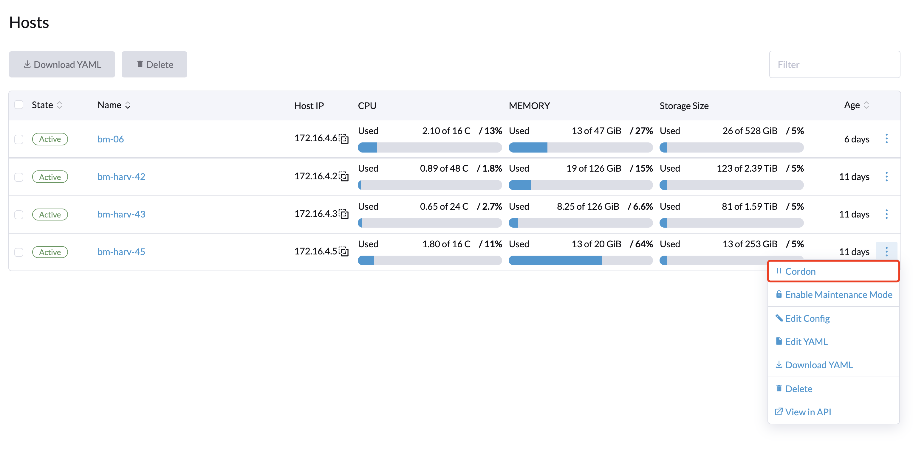
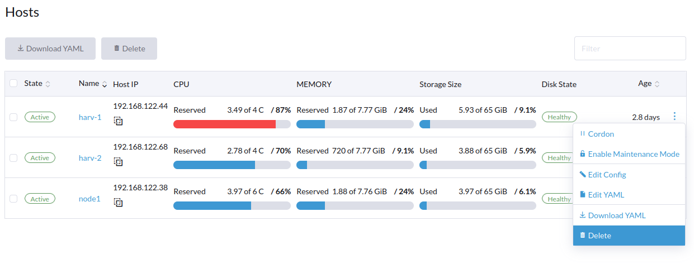

# Host Management

Users can view and manage Harvester nodes from the host page. The first node always defaults to be a management node of the cluster. When there are more than three nodes, the two other nodes that first joined are automatically promoted to management nodes to form a HA cluster.

!!!note
    Because Harvester is built on top of Kubernetes and uses etcd as its database, the maximum node fault toleration is one when there are three management nodes.

## Node Maintenance

For admin users, you can click **Enable Maintenance Mode** to evict all VMs from a node automatically. It will leverage the `VM live migration` feature to migrate all VMs to other nodes automatically. Note that at least two active nodes are required to use this feature.

## Cordoning a Node

Cordoning a node marks it as unschedulable. This feature is useful for performing short tasks on the node during small maintenance windows, like reboots, upgrades, or decommissions. When you’re done, power back on and make the node schedulable again by uncordoning it.

## Deleting a Node

Deleting a node is done in two phases:

1. Delete the node from Harvester
    - Go to the **Hosts** page
    - On the node you want to modify, click **⋮ > Delete**

2. Uninstall RKE2 from the node
    - Login to the node as root
    - Run `rke2-uninstall.sh` to delete the whole RKE2 service.

!!! warning
    You will lose all data of the control plane node after deleing the RKE2 service.

!!! note
    There's a [known issue](https://github.com/harvester/harvester/issues/1497) about node hard delete.
    Once resolved, the last step can be skipped.

## Multi-disk Management - `Tech Preview`

Users can view and add multiple disks as additional data volumes from the host detail page.

1. Go to the **Hosts** page.
2. On the node you want to modify, click **⋮ > Edit Config**.
2. Select the **Disks** tab and click **Add Disks**.
3. Select an additional raw block device to add as an additional data volume.
    - The `Force Formatted` option is required when the block device has once been force-formatted.

!!! note
    For Harvester to identify disks uniquely, it is required to have an unique WWN for each disk. Otherwise Harvester would refuse to add the disk.
    If your disk does not have a WWN, you can also format it in EXT4 format to help Harvester identify it.

!!! note
    If you are testing out Harvester within a QEMU environment, be aware of the version of QEMU itself. QEMU prior to v6.0 always generates the same WWN for NVMe disk emulations. Please use QEMU v6.0 or later to avoid such limitation.

