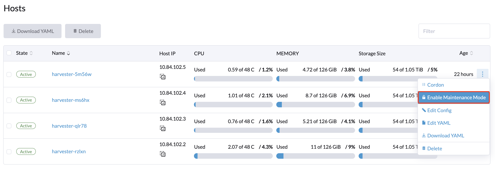
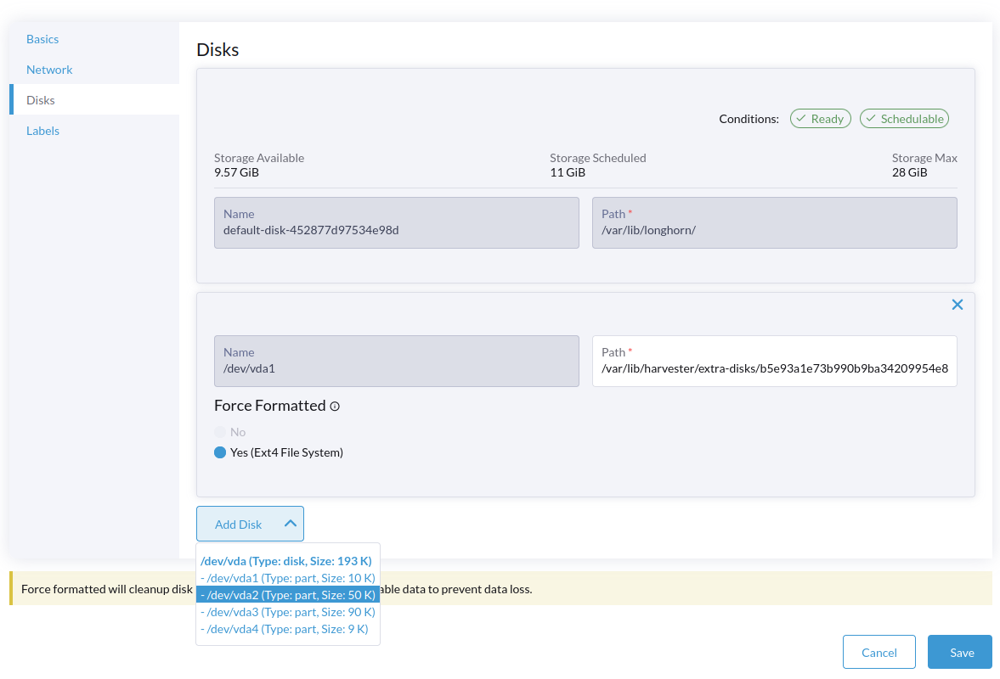

# Host Management

Users can view and manage the Harvester node from the host page, The first node always defaults to be a management node of the cluster,
when there is more than 3 node, the Harvester will automatically promote the other two first joined nodes to be the management nodes to form a HA cluster.

!!!note
    Because Harvester is built on top of the Kubernetes and uses the ETCD as its database, so with 3 management nodes the maximum node fault toleration is one.

## Node Maintenance

For the admin user, you can click `Enable Maintenance Mode` to evict all VMs from the node automatically, it will leverage the `VM live migration` feature to migrate all VMs to the other nodes automatically(Notes: At least 2 active nodes is required.)

## Multi-disk Management

Users can now view and add multiple disks as an additional data volumes from the host detail page.

1. Go to the `Hosts` page and click the `Edit Config`
2. Select the `Disks` tab and click `Add Disks`
3. Select to add either the additional raw block device or partitions as an additional data volume.
    - force-formatting is required when adding an entire raw block device to form a single root disk partition with ext4 filesystem format
    - it is optional to choose force-formatting a partition disk, force-formatting will be required when the partition's filesystem type does not match `ext4`, `XFS` or not found.

!!!note
    Multi-disk management feature is in tech preview.

