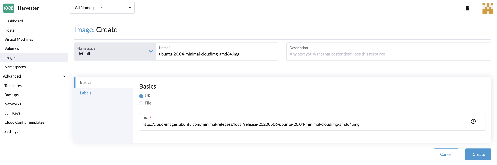

# Import Images

Currently supports the following three ways to create an image

### Upload images via url

To import virtual machine images in the **Images** page, enter a URL that can be accessed from the cluster. Description and labels are optional.
!!!note
    The image name will be auto-filled using the URL address's filename. You can always customize it when required.

### Upload image via local file

!!!note
    Please do not refresh the page until the file upload is finished

Currently, we support qcow2, raw, and ISO images.

### Create image via volume

You can go to the **volumes** page, click **Export Image**. Enter image name to create image.

