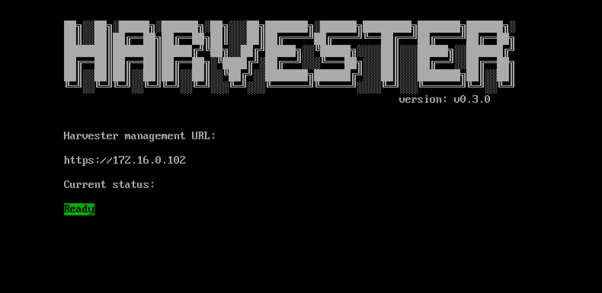

# Management Address
Harvester provides a fixed virtual IP (VIP) as the management address. Users can check the management address on the console dashboard after installation.

!!! note
    You will need to config static MAC-to-IP address mapping on your DHCP server to persist the Virtual IP accordingly.



## How to get the VIP MAC address

You can get the VIP MAC address via run the following command on the management node:
```shell
$ kubectl get svc -n kube-system ingress-expose -ojsonpath='{.metadata.annotations}'
```

Example of output:
```json
{"kube-vip.io/hwaddr":"02:00:00:09:7f:3f","kube-vip.io/requestedIP":"10.84.102.31"}
```

## Usages
The management address has two usages.

- Allow users to access the Harvester API/UI via `HTTPS` protocol.
- Used by the other nodes to join the cluster. 
  
