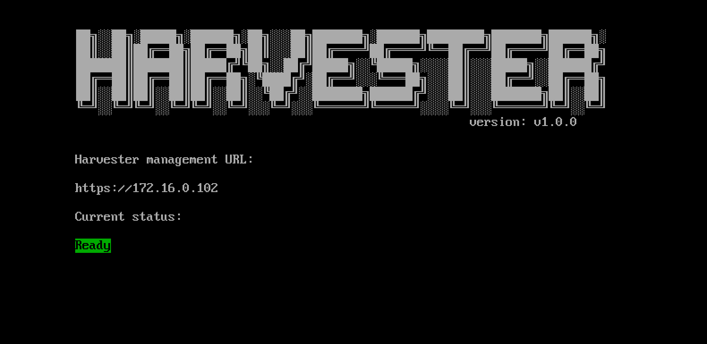

# Management Address
Harvester provides a fixed virtual IP (VIP) as the management address, VIP must be different than any NODE IP.  You can find the management address on the console dashboard after the installation.

!!! note
    If you selected the IP address to be configured via DHCP, you will need to configure static MAC-to-IP address mapping on your DHCP server in order to have a persistent Virtual IP



## How to get the VIP MAC address

To get the VIP MAC address, you can run the following command on the management node:
```shell
$ kubectl get svc -n kube-system ingress-expose -ojsonpath='{.metadata.annotations}'
```

Example of output:
```json
{"kube-vip.io/hwaddr":"02:00:00:09:7f:3f","kube-vip.io/requestedIP":"10.84.102.31"}
```

## Usages
The management address has two usages.

- Allows the access to the Harvester API/UI via `HTTPS` protocol.
- Is the address the other nodes use to join the cluster.
  

