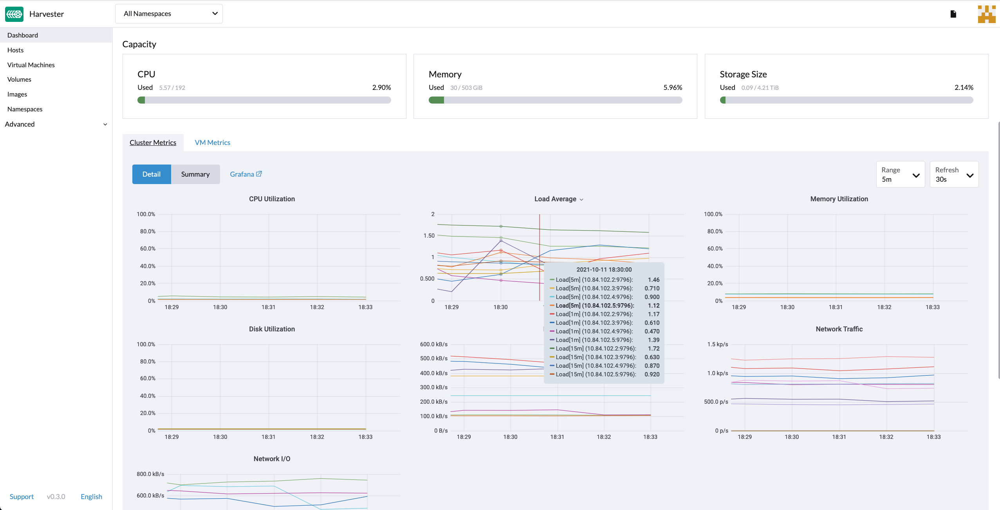

# Monitoring

_Available as of v0.3.0_

## Dashboard Metrics
Harvester `v0.3.0` has provided a built-in monitoring integration using the [Prometheus](https://prometheus.io/), the monitoring will be installed automatically from the ISO installation.

From the `Dashboard` page, users can view the cluster metrics and top 10 most used VM metrics respectively.
Also, users can click the Grafana dashboard link to view more dashboard on the Grafana UI.

!!!note
    only the admin users are able to view the dashboard metrics

## VM Detail Metrics
For each VM, users can view the VM metrics by clicking the VM details page.

