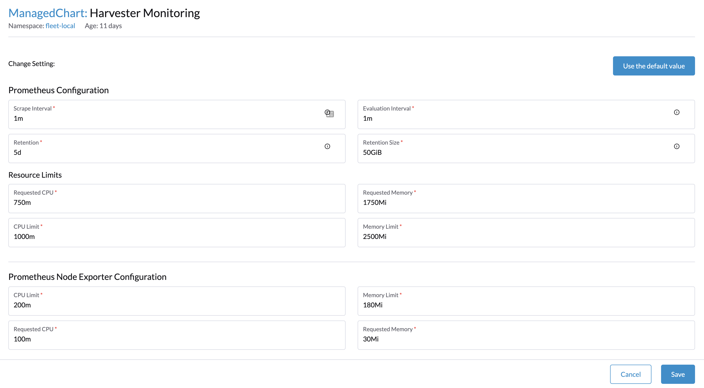

# Monitoring

_Available as of v0.3.0_

## Dashboard Metrics
Harvester `v0.3.0` has provided a built-in monitoring integration using [Prometheus](https://prometheus.io/). Monitoring is automatically installed during ISO installations.

From the `Dashboard` page, users can view the cluster metrics and top 10 most used VM metrics respectively.
Also, users can click the [Grafana](http://grafana.com/) dashboard link to view more dashboard on the Grafana UI.

!!! note
    Only admin users are able to view the dashboard metrics.

## VM Detail Metrics
For each VM, users can view the VM metrics by clicking the VM details page.

## Change resources setting of Monitoring
_Available as of v1.0.1_

The `Monitoring` has a couple of components to collect metrics data from all NODEs/PODs/VMs/... and summarize them. The resources required by the `Monitoring` are related to workloads and hardware resources. Harvester sets the default values according to engineering practices, and you can change them accordingly.

The following two components `resources settings` are available:

(1) Monitoring-Prometheus

(2) Monitoring-Prometheus-node-exporter

### Change resources settings of Monitoring-Prometheus

In the `Advanced Settings` page, you can view and change the resources settings as follow:

(1) Navigate to settings page, find `harvester monitoring`.

(2) Click `Show harvester-monitoring` to view the current values.

(3) Click in the up-right corner pop up menu and select `Edit Setting` to set a new value.

(4) Click `Save`. The `Monitoring` will be restarted with the new resources settings. Please note, the restart can take some time.

The most frequently used option is memory setting.

`Requested Memory` is the minimum memory of the `Monitoring`. The recommended value is about 5% to 10% of system memory of one single management node. A value less than 500Mi will be denied.

`Memory Limit` is the maximum memory of the `Monitoring`. The recommended value is about 30% of system memory of one single management node, when the `Monitoring` reaches this value, it will be restarted.

Depending on the available hardware resources and system loads, you may change the settings accordingly.

!!! note
    If you have multiple management nodes with different hardware resources, please set the value based on the smaller one.

### Change resources settings of Monitoring-Prometheus-node-exporter

`Monitoring-Prometheus-node-exporter` has a similar resources specifications as `Monitoring-Prometheus`. In future versions, a new `WebUI` setting will be available.

To update the values, you may use the CLI command: `kubectl edit managedchart rancher-monitoring -n fleet-local`.

The related path and default value are:

 `spec.values.prometheus.prometheus-node-exporter.resources.limits.cpu`:`200m`

 `spec.values.prometheus.prometheus-node-exporter.resources.limits.memory`:`180Mi`

 `spec.values.prometheus.prometheus-node-exporter.resources.requests.cpu`:`100m`

 `spec.values.prometheus.prometheus-node-exporter.resources.requests.memory`:`30Mi`

!!! attention
    When many VMs are deployed in one NODE, the OOM(out of memory)/abnormal restarting of prometheus-node-exporter POD(s) may be observed. In that case, you should change the `limits.memory` to a bigger value.
