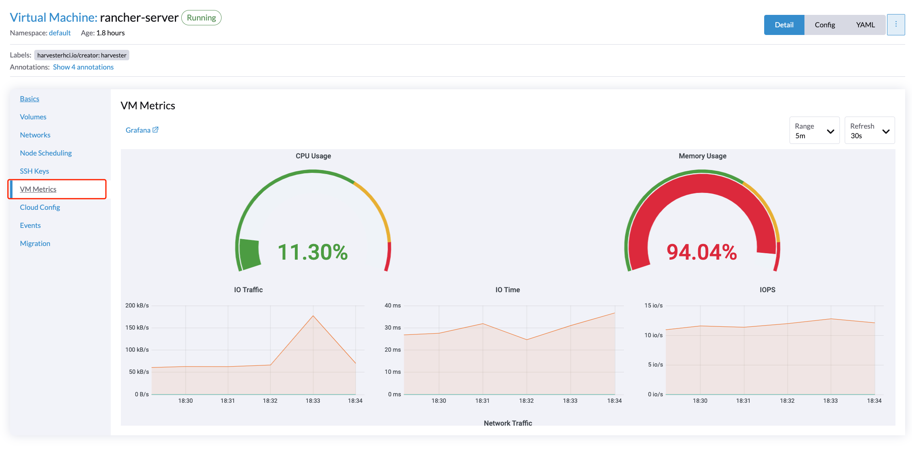

# Monitoring

_Available as of v0.3.0_

## Dashboard Metrics
Harvester `v0.3.0` has provided a built-in monitoring integration using the [Prometheus](https://prometheus.io/), the monitoring will be installed by default from the ISO mode.

From the dashboard page, users are able to view the cluster metrics and top 10 most used VM metrics.

## VM Detail Metrics
On each VM detail page, users can click the VM metrics tab to view the monitoring metrics of each VM.

