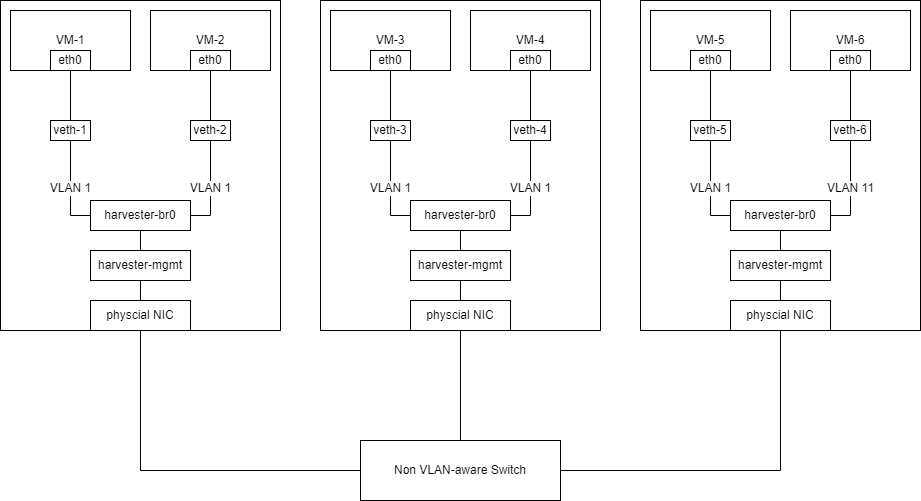
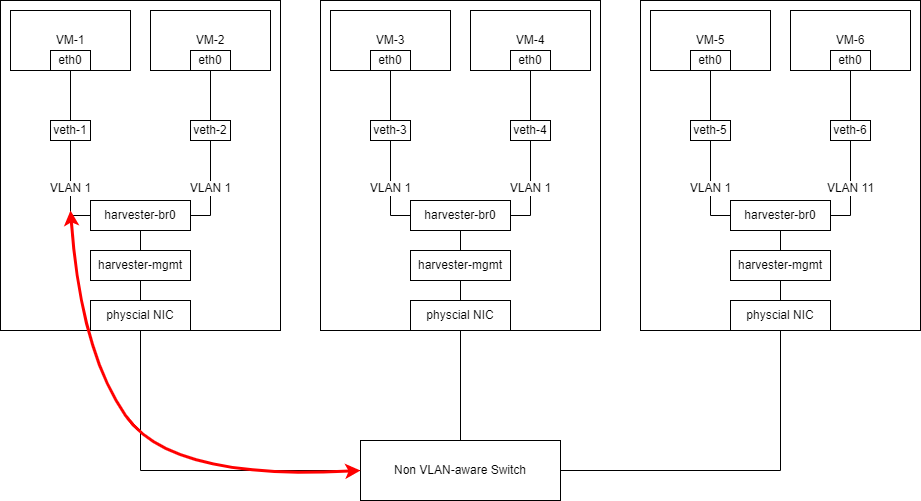

# Best Practice for Non VLAN-aware Switch

In this best practice guide for non VLAN-aware switch, dummy switch, we will introduce Harvester VLAN network and external switch configuration for common scenario.

## Architecture

Hardware:
- 3 Harvester servers with only single port network card
- non VLAN-aware switch, dummy switch

Network Specification:
- Management Network is same subnet as VM Network

Cabling:
- Harvester servers connect to switch port from port 1 to 3

The below diagram illustrates cabling in this guide.

   

## External Switch Configuration

Mostly, non VLAN-aware switch cannot be configured.

## Create a VLAN Network in Harvester

A new VLAN network can be created via the **Advanced > Networks** page and clicking the **Create** button.

Specify the name and VLAN ID that you want to create for the VLAN network <small>(You can specify the same vlan ID on different namespaces of [Rancher multi-tenancy](/rancher/virtualization-management/#multi-tenancy) support)</small>.
   

### Connect VM to the same network of Harvester management network

Non VLAN-aware switch will only send out untagged network traffic for manangement network. Inside Harvester, the default VLAN tag to receive untagged taffic is VLAN 1.

If users need VM connects to management network, users can create a VLAN Network in Harvester with VLAN ID 1 configuration.

   

Refer to [Harvester Network](/networking/harvester-network/)

!!! note
    In this case, creating VLAN Network with other VLAN ID will not take effect to node-to-node connectivity.
