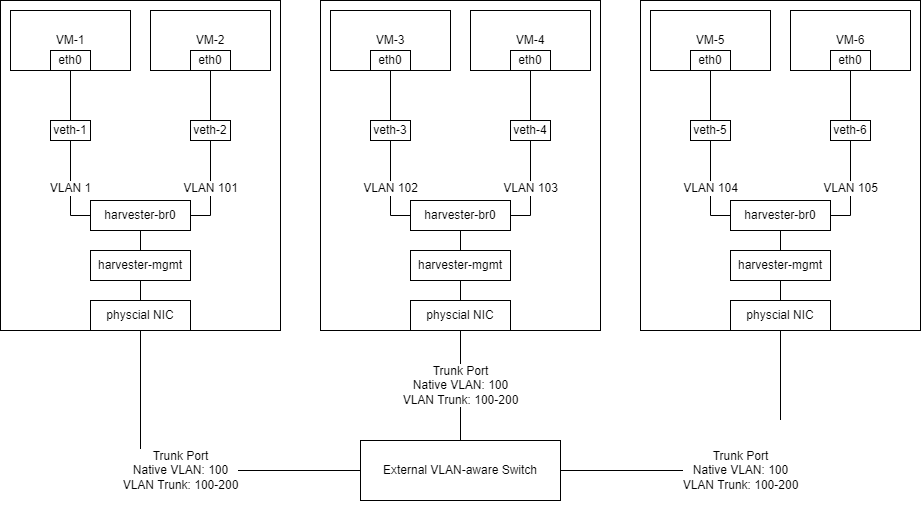
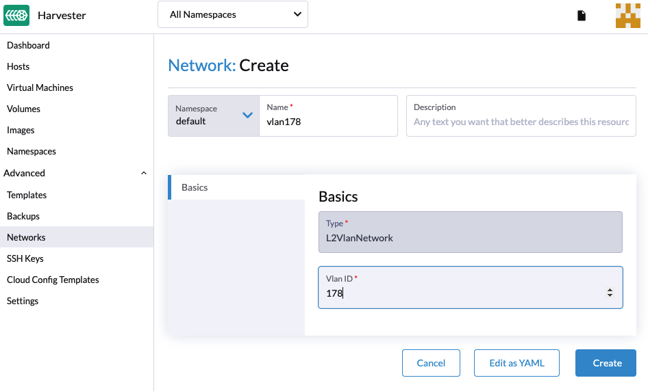
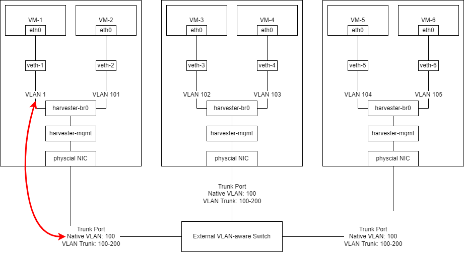

# Best Practice for VLAN-aware Switch

In this best practice guide on how to configure "VLAN-aware", we will introduce Harvester VLAN network and external switch configuration for common scenario.

## Architecture

Hardware:
- Three Harvester servers with only one single port network card.
- One or more VLAN-aware switch(es). We will use "Cisco like" configuration as example.

Network Specification:
- The Management Network to control Harvester servers needs to be set as VLAN 100.
- The VM Network needs to be in the VLAN 101-200 range.

Cabling:
- The Harvester servers are connected to the switch in a port from `1` to `3`.

The following diagram illustrates the cabling used for this guide:

   

## External Switch Configuration

For the external switch configuration, we'll use a "Cisco like" configuration as example. You can apply the following configurations to your switch:

```
switch# config terminal
switch(config)# interface ethernet1/<Port Number>
switch(config-if)# switchport
switch(config-if)# switchport mode trunk
switch(config-if)# switchport trunk allowed vlan 100-200
switch(config-if)# switchport trunk native vlan 100
switch(config-if)# no shutdown
switch(config-if)# end
switch# copy running-config startup-config
```

## Create a VLAN Network in Harvester

You can create a new VLAN network in the **Advanced > Networks** page, and click the **Create** button.

Specify the name and VLAN ID that you want to create for the VLAN network <small>(You can specify the same VLAN ID in different namespaces if you have [Rancher multi-tenancy](/rancher/virtualization-management/#multi-tenancy) configured)</small>.

   

### Connect a VM to the Harvester management network

Once you finished the configuration in the previous section, the external switch will send out untagged network traffic to the management network. In Harvester, the untagged traffic is received in VLAN 1.

If users need VM connects to VLAN 100, management network, users can create a VLAN Network in Harvester with VLAN ID 1 configuration instead of VLAN ID 100.

The external switch will remove the VLAN 100 tag from the packet for egress and `harvester-br0` will add the VLAN 1 tag to the packet and treat it as VLAN 1 as shown in the following diagram:

   

!!! warning
    Do not create a VLAN Network with VLAN 100 and associate any VM to it. The connectivity will not always be ensured and depends on the external switch behavior to add/remove VLAN tag from packets.

### Connect a VM to specific VLAN network

You need to create a VLAN Network with specific VLAN ID and associate the VM to that VLAN network. 

Please refer to [this page](/networking/harvester-network/) for additional information on Harvester Networking.
