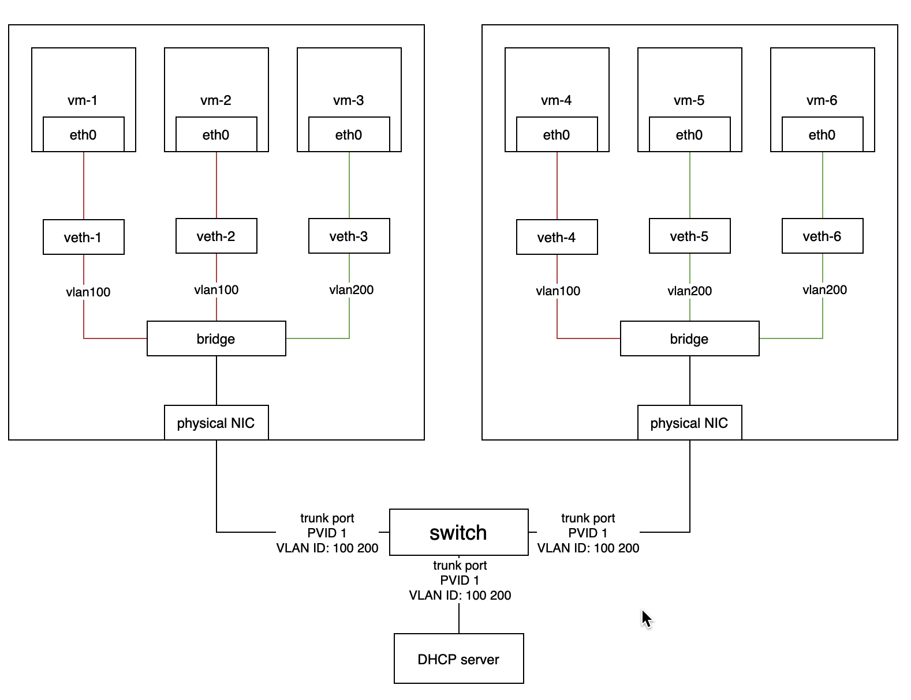
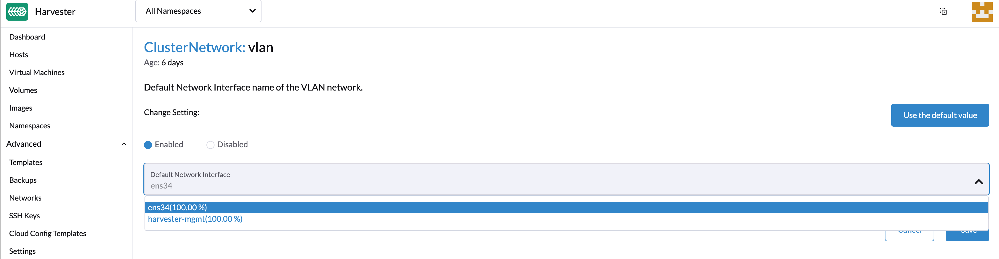
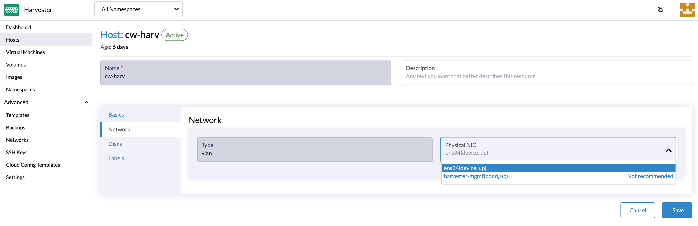
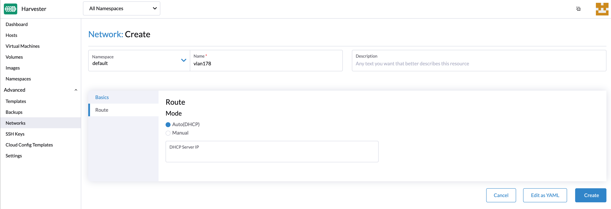
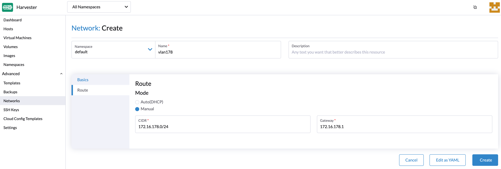
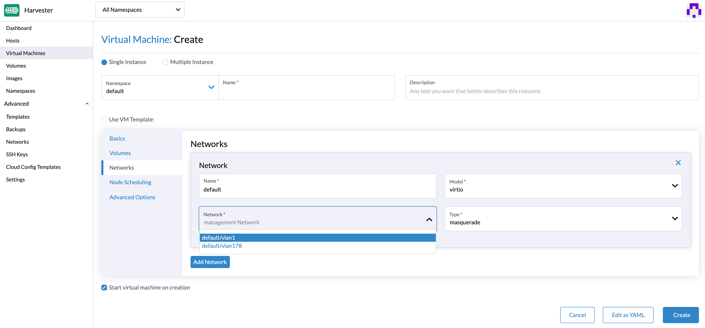

# Harvester Network

Harvester is built on top of [Kubernetes](https://kubernetes.io/) and leverages its built-in [CNI](https://github.com/containernetworking/cni) mechanism to provide the interface between network providers and its VM networks. 

We have implemented the Harvester VLAN network based on the [bridge](https://www.cni.dev/plugins/current/main/bridge/) CNI to provide a pure L2-mode network, that would bridge your VMs to the host network interface and can be connected using the physical switch for both internal and external network communication. 

Moreover, the Harvester UI integrates the [harvester-network-controller](https://github.com/harvester/network-controller-harvester) to provide user-friendly VLAN network configurations, e.g., to create and manage VLAN networks or to add a VLAN network to the VM. 

Currently, Harvester supports two types of networks:

- [Management network](#management-network)
- [VLAN](#vlan-network)


## Management Network

Harvester uses [flannel](https://github.com/flannel-io/flannel) CNI as its default management network. It is a built-in network that can be used directly from the cluster. However, the management network IP is not persisted and will be changed after a VM reboot.

Additionally, users can leverage the Kubernetes [service object](https://kubevirt.io/user-guide/virtual_machines/service_objects/) to create a stable IP for your VMs with the management network.


## VLAN Network

The [Harvester network-controller](https://github.com/harvester/harvester-network-controller) leverages the [multus](https://github.com/k8snetworkplumbingwg/multus-cni) and [bridge](https://www.cni.dev/plugins/current/main/bridge/) CNI plugins to implement its customized L2 bridge VLAN network. It helps to connect your VMs to the host network interface and can be accessed from internal and external networks using the physical switch.

The below diagram illustrates how the VLAN network works in Harvester.

  

- The Harvester network-controller creates a bridge for each node and a pair of veth for each VM to implement its VLAN network. The bridge acts as a switch to forward the network traffic from or to VMs and the veth pair is like the connected ports between VMs and the switch.
- VMs within the same VLAN can communicate with each other, while the VMs from different VLANs can't.
- The external switch ports connected to the hosts or other devices (such as the DHCP server) should be set as trunk or hybrid type and permit the specified VLANs.
- Users can use VLAN with `PVID` (default 1) to communicate with any normal untagged traffic.

### Enabling Default VLAN Network

You can enable VLAN network via **Setting > VLAN**. Once enabled, you will be able to select a network interface for the nodes as the default VLAN config.

For better network performances and isolation, we recommend to choose a separate network interface for the VLAN other than the one used for the management network (i.e., `harvester-mgmt`).

!!! note
    - When selecting the network interface, the value in parentheses represents the distribution percentage of the network interface on all hosts. If a network interface with a value less than 100% is selected, the network interface needs to be manually specified on the host where the VLAN network configuration fails.
    - Modifying the default VLAN network setting will not update the existing configured host network.
    - Harvester VLAN network supports bond interfaces, currently it can only be created automatically via [PEX Boot Configuration](/install/harvester-configuration/#example_11). Users may also login to the node and create it manually.

  

Optional: Users can customize each node's VLAN network via the **HOST > Network** tab.

  

### Create a VLAN Network

A new VLAN network can be created via the **Advanced > Networks** page and clicking the **Create** button.

 1. Specify the name and VLAN ID that you want to create for the VLAN network.
   
  
 2. Configure a route in order to allow the hosts to connect to the VLAN network using IPv4 addresses. The CIDR and gateway of the VLAN network are mandatory parameters for the route configuration.  You can configure the route by choosing one of the following options:
    - auto(DHCP) mode: the Harvester network controller will get the CIDR and gateway values from the DHCP server using the DHCP protocol. Optionally, you can specify the DHCP server address.
      
    - manual mode: You need to specify the CIDR and gateway values manually.
      

### Create a VM with VLAN Network
Users can now create a new VM using the above configured VLAN network,

- Click the **Create** button on the **Virtual Machines** page.
- Specify the required parameters and click the **Networks** tab.
- Either configure the default network to be a VLAN network or select an additional network to add.



!!! note
    - Only the first NIC will be enabled by default. Users can either choose to use a management network or a VLAN network. 
    - You will need to select the `Install guest agent` option in the **Advanced Options** tab to get the VLAN network IP address from the Harvester UI.


- Users can choose to add one or multiple network interface cards. Additional network interface card can be enabled by default via setting the cloud-init network data. E.g.,
```YAML
version: 1
config:
  - type: physical
    name: enp1s0 # name is varies upon OS image
    subnets:
      - type: dhcp
  - type: physical
    name: enp2s0
    subnets:
      - type: DHCP
```
For more detailed configs you may refer to the [cloud-init network configs](https://cloudinit.readthedocs.io/en/latest/topics/network-config-format-v2.html).

### Configure DHCP servers on Networks

By default, the Harvester VLAN network would expect your router to provide a DHCP server that VMs can request and assign IP addresses automatically.

If you are running Harvester in a virtual environment that does not contain a DHCP server, you may consider deploying a DHCP server manually in a node or using a containerized method. Refer to [this issue](https://github.com/harvester/harvester/issues/947) as an example.
