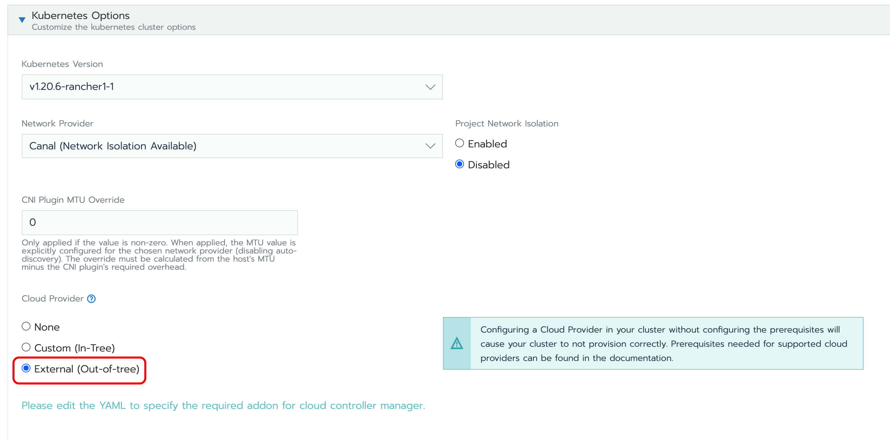

# Harvester Cloud Provider

_Available as of v0.3.0_

The Harvester cloud provider used by the guest cluster in Harvester provides a CSI driver and cloud controller manager(CCM) which implements a built-in load balancer. In this section, you will learn about the following:

- How to deploy the Harvester cloud provider in RKE and RKE2

- How to configure the load balancer with the annotation of services

## Deploying
### Prerequisites
- The Kubernetes cluster is built on top of Harvester virtual machines.
- The Harvester virtual machines run as guest Kubernetes nodes are in the same namespace.

### Deploying to the RKE cluster with Harvester node driver
When spinning up an RKE cluster using the Harvester node driver, you can perform two steps to deploy the `Harvester` cloud provider:

- Select the `External` cloud provider.

  
  
- Generate add-on configuration and add it to the RKE YAML file.
  ```
  # depend on kubectl to operate the Harvester cluster
  curl -sfL https://raw.githubusercontent.com/harvester/cloud-provider-harvester/master/deploy/generate_addon.sh | sh -s <serviceAccount name> <namespace>
  ```
  
### Deploying to the RKE2 cluster with Harvester node driver
When spinning up an RKE2 cluster using the Harvester node driver, select the `Harvester` cloud provider. The node driver will then help deploy both the CSI driver and CCM automatically.

  

## Load Balancer Request Parameters
When setting up a Kubernetes service of `load balancer` type, you can configure the load balancer with the `service annotations`.

!!!note
    Both the `cloudprovider.harvesterhci.io/ipam` and `cloudprovider.harvesterhci.io/healthcheck-port` are required to add in the service annotation fields.

### IPAM
The Harvester built-in load balancer supports both `pool` and `dhcp` modes to specify the load balancer IP by the annotation key **`cloudprovider.harvesterhci.io/ipam`.** The value defaults to `pool`.

- pool: You should configure an IP address pool in Harvester in advance. The Harvester LoadBalancer controller will allocate an IP address from the IP address pool for the load balancer. Refer to the [guideline](https://github.com/kube-vip/kube-vip-cloud-provider#global-and-namespace-pools) to configure an IP address pool.
                                                                                                                                                                                                  
- dhcp:  A DHCP server is required. The Harvester LoadBalancer controller will request an IP address from the DHCP server.

### Health Checks
The Harvester load balancer supports TCP health checks. Example annotation is as follows:

- `cloudprovider.harvesterhci.io/healthcheck-port` specifies the port. The prober will access the address composed of the backend server IP and the port. This option is required.

- `cloudprovider.harvesterhci.io/healthcheck-success-threshold` specifies the health check success threshold. The default value is 1. If the number of times that the prober continuously successfully detects an address reaches the success threshold, the backend server can start to forward traffic.

- `cloudprovider.harvesterhci.io/healthcheck-failure-threshold` specifies the success and failure threshold. The default value is 3. The backend server will stop forwarding traffic if the number of health check failures reaches the failure threshold. 

- `cloudprovider.harvesterhci.io/healthcheck-periodseconds` specifies the health check period. The default value is 5 seconds.

- `cloudprovider.harvesterhci.io/healthcheck-timeoutseconds` specifies the timeout of every health check. The default value is 3 seconds.
