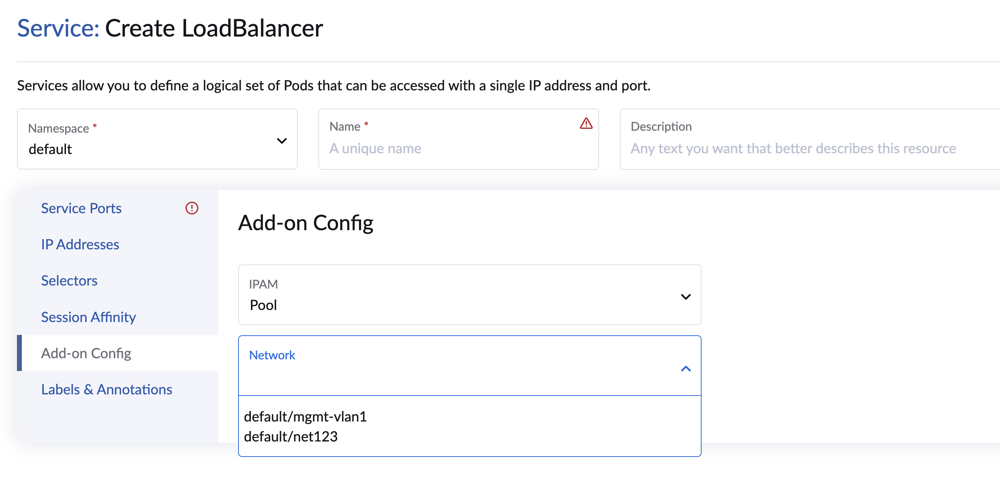

<head>
  <link rel="canonical" href="https://docs.harvesterhci.io/v1.8/rancher/cloud-provider"/>
</head>

[RKE2](./node/rke2-cluster.md) clusters can be provisioned in Rancher using the built-in Harvester Node Driver. Harvester provides [load balancer](#load-balancer-support) and Harvester cluster [storage passthrough](./csi-driver.md) support to the guest Kubernetes cluster.

In this page we will learn:

- How to deploy the Harvester cloud provider in an RKE2 cluster.
- How to use the [Harvester load balancer](#load-balancer-support).

### Backward Compatibility Notice

:::note

Please note a known backward compatibility issue if you're using the Harvester cloud provider version **v0.2.2** or higher. If your Harvester version is below **v1.2.0** and you intend to use newer RKE2 versions (i.e., >= `v1.26.6+rke2r1`, `v1.25.11+rke2r1`, `v1.24.15+rke2r1`), it is essential to upgrade your Harvester cluster to v1.2.0 or a higher version before proceeding with the upgrade of the guest Kubernetes cluster or Harvester cloud provider.

For a detailed support matrix, please refer to the **Harvester CCM & CSI Driver with RKE2 Releases** section of the official [website](https://www.suse.com/suse-harvester/support-matrix/all-supported-versions/).

:::

## Deploying

### Prerequisites
- The Kubernetes cluster is built on top of Harvester virtual machines.
- The Harvester virtual machines run as guest Kubernetes nodes are in the same namespace.

:::info important

Each Harvester VM must have the `macvlan` kernel module, which is required for the `LoadBalancer` services of the **DHCP** IPAM mode.

To check if the kernel module is available, access the VM and run the following commands:

```shell
lsmod | grep macvlan
sudo modprobe macvlan
```

The kernel module is likely to be missing if the following occur:

- `$ lsmod | grep macvlan` does not produce output.
- `$ sudo modprobe macvlan` displays an error message similar to `modprobe: FATAL: Module macvlan not found in directory /lib/modules/5.14.21-150400.22-default`.

By default, the `macvlan` kernel module is not included in SUSE Linux Enterprise 15 Service Pack 4/5/6 minimal cloud images (see [Issue #6418](https://github.com/harvester/harvester/issues/6418)). Those images contain the [`kernel-default-base`](https://software.opensuse.org/package/kernel-default-base) package, which includes only the base modules. However, the `macvlan` kernel driver becomes available when you install the `kernel-default` package.

To eliminate the need for manual intervention after the guest cluster is provisioned, build your own cloud images using the openSUSE Build Service (OBS). You must remove the `kernel-default-base` package and add the `kernel-default` package in the `Minimal.kiwi` file to ensure that the resulting cloud image includes the `macvlan` kernel module. For more information, see [Custom SUSE VM Images](../advanced/customsuseimages.md).

:::

### Deploying to the RKE2 Cluster with Harvester Node Driver

When spinning up an RKE2 cluster using the Harvester node driver, select the `Harvester` cloud provider. The node driver will then help deploy both the CSI driver and CCM automatically.

  

Starting with Rancher v2.9.0, you can configure a specific folder for cloud config data using the **Data directory configuration path** field.

  

### Manually Deploying to the RKE2 Cluster

1. [Generate the cloud-config for the Harvester Cloud Provider](#generate-the-cloud-config-for-harvester-cloud-provider).

1. On the RKE2 cluster creation page, go to the **Cluster Configuration** screen and set the value of **Cloud Provider** to **External**.

    

1. Copy and paste the `cloud-init user data` content to **Machine Pools** > **Show Advanced** > **User Data**.

    

1. Add the `HelmChart` CRD for `harvester-cloud-provider` to **Cluster Configuration** > **Add-On Config** > **Additional Manifest**.

    You must replace `<cluster-name>` with the name of your cluster.

    ```
    apiVersion: helm.cattle.io/v1
    kind: HelmChart
    metadata:
      name: harvester-cloud-provider
      namespace: kube-system
    spec:
      targetNamespace: kube-system
      bootstrap: true
      repo: https://raw.githubusercontent.com/rancher/charts/dev-v2.9
      chart: harvester-cloud-provider
      version:  104.0.2+up0.2.6
      helmVersion: v3
      valuesContent: |-
        global:
          cattle:
            clusterName: <cluster-name>
    ```

    

1. To create the load balancer, add the annotation `cloudprovider.harvesterhci.io/ipam: <dhcp|pool>`.

    


### Deploying to the RKE2 custom cluster (experimental)

In the Rancher UI, you can create a `Custom` RKE2 cluster with **Harvester Cloud Provider**.


1. [Generate the cloud-config for the Harvester Cloud Provider](#generate-the-cloud-config-for-harvester-cloud-provider).

1. Create a VM in the Harvester cluster with the following settings:

    - **Basics** tab: The minimum requirements are 2 CPUs and 4 GiB of RAM. The required disk space depends on the VM image.

      

    - **Networks** tab: Specify a network name with the format `nic-<number>`.

      

    - **Instance Labels** tab: Add two required labels: `guestcluster.harvesterhci.io/name: <cluster-name>` and `harvesterhci.io/creator: docker-machine-driver-harvester`.

      

    - **Advanced Options** tab: Copy and paste the content of the **Cloud Config User Data** screen.

      

    :::note

    **Instance Labels** are critical for Harvester to manage resource allocation and deallocation for guest clusters. If these labels are missing, features like the guest cluster LoadBalancer in `Pool` mode may not work, as the Harvester node driver cannot identify the guest cluster.

    :::

1. On the **Basics** tab of the **Cluster Configuration** screen, select **Harvester** as the **Cloud Provider** and then select **Create** to spin up the cluster.

    

    Click **Add-on: Harvester Cloud Provider** to verify the `Cloud config file path`. On newer versions, this defaults to `/var/lib/rancher/rke2/etc/config-files/cloud-provider-config`. Ensure this value matches the `path` you set under `write_files:` in the previous step.

    

1. On the **Registration** tab, perform the steps required to run the RKE2 registration command on the VM.

    

1. (Optional) Verify the customized cluster YAML to ensure the following fields are correctly set:
    - `.spec.rkeConfig.chartValues.harvester-cloud-provider.global.cattle.clusterName`
    - `.spec.rkeConfig.chartValues.harvester-cloud-provider.cloudConfigPath`
    If either field is missing or incorrect, update it in the YAML file.

    

### Deploying to the K3s cluster with Harvester node driver (experimental)

When spinning up a K3s cluster using the Harvester node driver, you can perform the following steps to deploy the harvester cloud provider:

1. [Generate the cloud-config for the Harvester Cloud Provider](#generate-the-cloud-config-for-harvester-cloud-provider).

2. Copy and paste the `cloud-init user data` content to **Machine Pools >Show Advanced > User Data**.
   

3. Add the following `HelmChart` yaml of `harvester-cloud-provider` to **Cluster Configuration > Add-On Config > Additional Manifest**.

    ```
    apiVersion: helm.cattle.io/v1
    kind: HelmChart
    metadata:
      name: harvester-cloud-provider
      namespace: kube-system
    spec:
      targetNamespace: kube-system
      bootstrap: true
      repo: https://charts.harvesterhci.io/
      chart: harvester-cloud-provider
      version: 0.2.2
      helmVersion: v3
    ```

    

4. Disable the `in-tree` cloud provider in the following ways:

    - Click the `Edit as YAML` button.

    
    - Disable `servicelb` and set `disable-cloud-controller: true` to disable the default K3s cloud controller.
    ```yaml
        machineGlobalConfig:
          disable:
            - servicelb
          disable-cloud-controller: true
    ```

    - Add `cloud-provider=external` to use the Harvester cloud provider.
    ```yaml
        machineSelectorConfig:
          - config:
              kubelet-arg:
              - cloud-provider=external
              protect-kernel-defaults: false
    ```

    

With these settings in place a K3s cluster should provision successfully while using the external cloud provider.


### Generate the cloud-config for Harvester Cloud Provider

The **Harvester Cloud Provider** requires a cloud-config file to connect to the remote Harvester cluster (for example, to query virtual machine information or allocate load balancers). You can generate this file using either the API endpoint or a bash script.

:::info important

Support for the bash script method will be deprecated in a future release. Use the API endpoint to ensure long-term compatibility.

:::

<Tabs>
<TabItem value="ui" label="API" default>

_Available as of v1.9.0_

You can send `POST` and `GET` requests to the Harvester API endpoint `/v1/harvester/kubeconfig` using an admin bearer token.

#### Request Parameters

| Parameter | Type | Description | Example |
| :--- | :--- | :--- | :--- |
| `namespace` | String | Target Kubernetes namespace | `gc-test` |
| `serviceAccountName` | String | Service account name | `gc4` |
| `clusterRoleName` | String | ClusterRole to bind to the service account (optional) | `harvesterhci.io:cloudprovider` (only supported value) |
| `outputFormat` | String | Output format | `yaml` (only supported value) |

:::note

- `clusterRoleName`: Harvester uses `harvesterhci.io:cloudprovider` by default if this field is left empty.
- `outputFormat`: Setting this to `yaml` retrieves the cloud-init user data. Specifying any other value or leaving the field empty returns the raw kubeconfig file.

:::

#### `POST` Request

Add `-k`/`--insecure` to the `curl` command only if your Harvester endpoint uses a self-signed certificate.

```bash
 curl -X POST \
  -H "Authorization: Bearer token-abcde:..." \
  -H "Content-Type: application/json" \
  -d '{"namespace": "gc-test", "serviceAccountName": "gc4", "outputFormat": "yaml"}' \
  "https://<vip>/v1/harvester/kubeconfig"
```

#### `POST` Response

```yaml
########## cloud-init user data ############
write_files:
- encoding: b64
  content: <BASE64_CONTENT>
  owner: root:root
  path: /etc/kubernetes/cloud-config
  permissions: '0644'
- encoding: b64
  content: <BASE64_CONTENT>
  owner: root:root
  path: /var/lib/rancher/rke2/etc/config-files/cloud-provider-config
  permissions: '0644'
```

#### `GET` Request

Use a single ampersand (`&`) to separate query parameters.

```bash
curl -X GET \
  -H "Authorization: Bearer token-abcde:..." \
  "https://<vip>/v1/harvester/kubeconfig?namespace=gc-test&serviceAccountName=gc4&outputFormat=yaml"
```

#### `GET` Response

The API response automatically includes cloud-init configurations for both legacy and new paths. Before applying this configuration, remove the block that does not apply to your environment.

```yaml
########## cloud-init user data ############
write_files:
- encoding: b64
  content: <BASE64_CONTENT>
  owner: root:root
  path: /etc/kubernetes/cloud-config
  permissions: '0644'
- encoding: b64
  content: <BASE64_CONTENT>
  owner: root:root
  path: /var/lib/rancher/rke2/etc/config-files/cloud-provider-config
  permissions: '0644'
```

</TabItem>
<TabItem value="api" label="Bash Script">

1. Generate the cloud-config data using the `generate_addon.sh` script.

    ```bash
    curl -sfL https://raw.githubusercontent.com/harvester/cloud-provider-harvester/master/deploy/generate_addon.sh | bash -s <serviceaccount name> <namespace>
    ```

1. Copy the generated data to every node.

    - Legacy path: `/etc/kubernetes/cloud-config`
    - RKE2 default path (v1.9.0 and later): `/var/lib/rancher/rke2/etc/config-files/cloud-provider-config`

:::note

The script requires `kubectl` and `jq` to interact with the Harvester cluster, and functions only when given access to the Harvester cluster's kubeconfig file.

You can find the kubeconfig file on any Harvester management node at the following path: `/etc/rancher/rke2/rke2.yaml`. Before using the kubeconfig file, you must replace the IP address in the `server: field` with your cluster's VIP address.

Example of content:

```yaml
apiVersion: v1
clusters:
- cluster:
    certificate-authority-data: <redacted>
    server: https://127.0.0.1:6443
  name: default
# ...
```

You must specify the namespace in which the guest cluster will be created.

:::

Example of output:

```yaml
########## cloud config ############
apiVersion: v1
clusters:
- cluster:
    certificate-authority-data: <CACERT>
    server: https://HARVESTER-ENDPOINT/k8s/clusters/local
  name: local
contexts:
- context:
    cluster: local
    namespace: default
    user: harvester-cloud-provider-default-local
  name: harvester-cloud-provider-default-local
current-context: harvester-cloud-provider-default-local
kind: Config
preferences: {}
users:
- name: harvester-cloud-provider-default-local
  user:
    token: <TOKEN>

########## cloud-init user data ############
write_files:
- encoding: b64
  content: <CONTENT>
  owner: root:root
  path: /etc/kubernetes/cloud-config
  permissions: '0644'
```

:::note

In newer RKE2 versions (such as v1.33.11), the default cloud-config path is `/var/lib/rancher/rke2/etc/config-files/cloud-provider-config`. You must ensure that the `cloudConfigPath` value matches the exact file location you write to.

Depending on your setup, choose one of the following approaches:

- **Use the RKE2 default path**: In the `write_files` entry in your cloud-init configuration, change the value of `path` to `/var/lib/rancher/rke2/etc/config-files/cloud-provider-config`.

- **Keep the legacy path**: In the Rancher UI, set `.spec.rkeConfig.chartValues.harvester-cloud-provider.cloudConfigPath` to `/etc/kubernetes/cloud-config`.

:::

</TabItem>
</Tabs>

## Upgrade Cloud Provider

### Upgrade RKE2
The cloud provider can be upgraded by upgrading the RKE2 version. You can upgrade the RKE2 cluster via the Rancher UI as follows:
1. Click **☰ > Cluster Management**.
2. Find the guest cluster that you want to upgrade and select ⋮ **> Edit Config**.
3. Select **Kubernetes Version**.
4. Click **Save**.

### Upgrade K3s
K3s upgrade cloud provider via the Rancher UI, as follows:
1. Click **☰ > K3s Cluster > Apps > Installed Apps**.
2. Find the cloud provider chart and select ⋮ **> Edit/Upgrade**.
3. Select **Version**.
4. Click **Next > Update**.

:::info

The upgrade process for a [single-node guest cluster](../advanced/singlenodeclusters) may stall when the new `harvester-cloud-provider` pod is stuck in the *Pending* state. This issue is caused by a section in the `harvester-cloud-provider` deployment that describes the rolling update strategy. Specifically, the default value conflicts with the `podAntiAffinity` configuration in single-node clusters.

For more information, see [this GitHub issue comment](https://github.com/harvester/harvester/issues/5348#issuecomment-2055453709). To address the issue, manually delete the old `harvester-cloud-provider` pod. You might need to do this multiple times until the new pod can be successfully scheduled.

:::

## Load Balancer Support
Once you've deployed the Harvester cloud provider, you can leverage the Kubernetes `LoadBalancer` service to expose a microservice within the guest cluster to the external world. Creating a Kubernetes `LoadBalancer` service assigns a dedicated Harvester load balancer to the service, and you can make adjustments through the `Add-on Config` within the Rancher UI.


### IPAM
Harvester's built-in load balancer offers both **DHCP** and **Pool** modes, and you can configure it by adding the annotation `cloudprovider.harvesterhci.io/ipam: $mode` to its corresponding service. Starting from Harvester cloud provider >= v0.2.0, it also introduces a unique **Share IP** mode. A service shares its load balancer IP with other services in this mode.

- **DHCP:** A DHCP server is required. The Harvester load balancer will request an IP address from the DHCP server.

  Starting with **Rancher v2.15.1**, you can select a **VM network** from the UI when creating a `LoadBalancer` service. This tells the load balancer which network interface to use, so the VIP is bound to the correct interface instead of always defaulting to the management interface. If no VM network is selected, the behavior is the same as before.

  On older Rancher versions (v2.12.x, v2.13.x, and v2.14.x), the UI does not have this option, but you can still achieve the same result by setting the following annotations on the service:

  - `cloudprovider.harvesterhci.io/ipam: "dhcp"`
  - `cloudprovider.harvesterhci.io/network: "default/mgmt-vlan1"`

  

- **Pool:** An [IP pool](../networking/ippool.md) must be configured first. The Harvester load balancer controller will allocate an IP for the load balancer service following [the IP pool selection policy](../networking/ippool.md#selection-policy). Notice the difference between [Create IP Pool from Harvester UI directly](../networking/ippool.md#how-to-create) and [Create IP Pool from Rancher Manager UI](../networking/ippool.md#create-ip-pool-from-rancher-manager-ui). Refer to the [Best Practice](../networking/ippool.md#best-practice).

    Starting with **Rancher v2.15.1**, you can select a **VM network** from the UI when creating a `LoadBalancer` service to explicitly bind the load balancer to a specific network interface. If no VM network is selected, the load balancer controller automatically determines the network.

    On older Rancher versions (v2.12.x, v2.13.x, and v2.14.x), the UI does not have this option, but you can still achieve the same result by setting the following annotations on the service:

    - `cloudprovider.harvesterhci.io/ipam: "ippool"`
    - `cloudprovider.harvesterhci.io/network: "default/mgmt-vlan1"`

    When a guest cluster uses multiple networks, or when multiple guest clusters with distinct networks share a single namespace, configuring the correct network parameters is critical. For details on how the system automatically determines the network, refer to [Guest Cluster Load Balancer Network Resolution](../networking/ippool.md#guest-cluster-load-balancer-network-resolution).

    

- **Share IP:** When creating a new load balancer service, you can re-utilize an existing load balancer service IP. The new service is referred to as a secondary service, while the currently chosen service is the primary one. To specify the primary service in the secondary service, you can add the annotation `cloudprovider.harvesterhci.io/primary-service: $primary-service-name`.  However, there are two known limitations:
  - Services that share the same IP address can't use the same port.
  - Secondary services cannot share their IP with additional services.

:::note

- Modifying the `IPAM` mode isn't allowed. You must create a new service if you intend to change the `IPAM` mode.

- Refer to [Guest Cluster Loadbalancer IP is not reachable](../troubleshooting/rancher.md#guest-cluster-loadbalancer-ip-is-not-reachable).

:::

#### Asymmetric Network Topology

The VM network dropdown only shows networks that are attached to the **same interface position** across all nodes. This means:

- **All nodes share the same networks on the same interfaces** — all networks appear in the dropdown.

  ```
  Node A: enp1s0 → management, enp2s0 → net-101
  Node B: enp1s0 → management, enp2s0 → net-101
  ```
  Both `management` and `net-101` appear in the dropdown.

- **Same network, but different interface position across nodes** — the network does **not** appear in the dropdown.

  ```
  Node A: enp1s0 → management, enp2s0 → net-101
  Node B: enp1s0 → management, enp2s0 → net-102, enp3s0 → net-101
  ```
  `net-101` is on `enp2s0` for Node A but `enp3s0` for Node B, so it will not appear.

- **Network missing on some nodes** — the network does **not** appear in the dropdown.

  ```
  Node A: enp1s0 → management
  Node B: enp1s0 → management, enp2s0 → net-101
  ```
  `net-101` is absent from Node A, so it will not appear.

- **Same networks on all nodes, but attached in a different order** — only the management network appears in the dropdown.

  ```
  Node A: enp1s0 → management, enp2s0 → net-101, enp3s0 → net-102
  Node B: enp1s0 → management, enp2s0 → net-102, enp3s0 → net-101
  ```
  Both nodes have all three networks, but `net-101` and `net-102` are swapped. Only `management` is on the same interface across all nodes, so only `management` appears in the dropdown.

For the case where the same VM network is attached but in a different NIC order across nodes, the workaround is to shut down the affected VMs, reorder the network interfaces so the attachment order is consistent across all nodes, and restart the VMs.

### Health checks

Beginning with Harvester cloud provider v0.2.0, additional health checks of the `LoadBalancer` service within the guest Kubernetes cluster are no longer necessary. Instead, you can configure [liveness](https://kubernetes.io/docs/tasks/configure-pod-container/configure-liveness-readiness-startup-probes/#define-a-tcp-liveness-probe) and [readiness](https://kubernetes.io/docs/tasks/configure-pod-container/configure-liveness-readiness-startup-probes/#define-readiness-probes) probes for your workloads. Consequently, any unavailable pods will be automatically removed from the load balancer endpoints to achieve the same desired outcome.

### Automatic Cleanup

_Available as of Harvester v1.8.0_

When a guest cluster with the `harvester-cloud-provider` enabled is deleted, Harvester automatically performs a cleanup of all associated `LoadBalancer` resources on the host cluster.

Key benefits:

- Resource Management: Prevents "orphaned" LoadBalancers from consuming IP addresses after a guest cluster is gone.

- Zero Manual Intervention: The lifecycle of the LoadBalancer is tied directly to the lifecycle of the guest Kubernetes cluster.

## Known Issue: Stale Harvester CloudCredentials after re-registering cluster

If a Harvester cluster is removed from Rancher and later re-registered, Rancher may retain stale Harvester CloudCredentials that reference the previous management cluster ID.

This can cause downstream cluster provisioning (for example, RKE2 or K3s clusters) to fail with errors such as:

  ```bash
    clusters.management.cattle.io "<old-cluster-id>" not found
  ```


The existing CloudCredential still references the old Harvester cluster ID, which no longer exists after re-registration. 

### Workaround

1. Go to **Rancher > Cluster Management > Cloud Credentials**.
2. Delete the old Harvester CloudCredential associated with the removed cluster.
3. Create a new Harvester CloudCredential.
4. Retry provisioning the downstream cluster.

Related issue: [#53642](https://github.com/rancher/rancher/issues/53642)