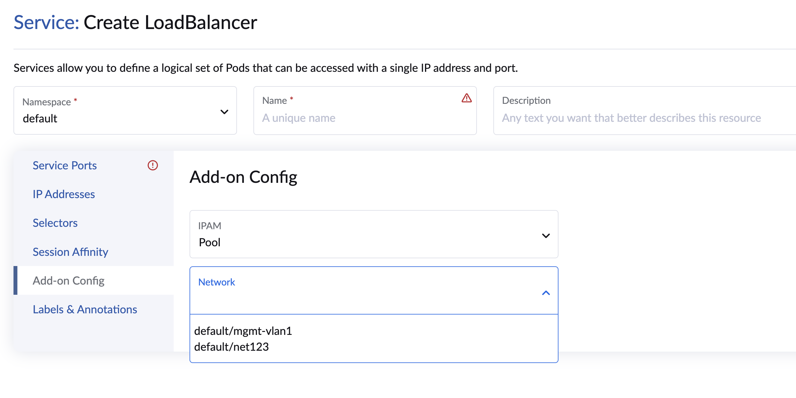

<head>
  <link rel="canonical" href="https://docs.harvesterhci.io/v1.8/rancher/cloud-provider"/>
</head>

## Introduction

You can provision [RKE2](./node/rke2-cluster.md) clusters in Rancher using the built-in **Harvester Node Driver**. This component provides [load balancer](#load-balancer-support) and [storage passthrough](./csi-driver.md) capabilities to guest Kubernetes clusters.

In this page we will learn:

- The main functionality and key configuration parameters of the **Harvester Cloud Provider**.
- How to deploy the **Harvester Cloud Provider** in an RKE2 cluster.
- How to use the [Harvester load balancer](#load-balancer-support).

### Main Functionalities

The **Harvester Cloud Provider** (also known as **Cloud Controller Manager**) implements a subset of the `cloudprovider` interface defined by `k8s.io/cloud-provider`.

- **[Node metadata discovery and reporting](#node-instance-metadata-support)**: Dynamically discovers and reports node metadata (such as node names, regions, zones, and IP addresses), acting as a critical bootstrap component for the guest cluster.

- **[Load balancer provisioning](#load-balancer-support)**: Automatically provisions and configures load balancers for Kubernetes `Service` objects (type: `LoadBalancer`), routing external traffic to the correct guest nodes.

### Strictly Cloud-Native Operation

The Harvester Cloud Provider is built on the Kubernetes Cloud Controller Manager (CCM) framework. It operates natively by querying and managing resources directly through the Harvester Kubernetes API server:

- **API-driven metadata**: Retrieves node metadata (such as `ProviderID`, region/zone topology, and IP addresses) by observing `VirtualMachineInstance` (VMI) status directly from the API server, eliminating host-level commands and hard-coded network interfaces or ports. Using the VMI status as the single source of truth guarantees consistent and deterministic metadata reporting across all nodes, providing a reliable foundation for downstream node lifecycle synchronization and load balancer traffic routing.

- **Centralized management**: Runs as a standard Deployment rather than a per-node DaemonSet, centrally querying and monitoring virtual machine metadata across the guest cluster via standard Kubernetes API interactions.

- **CCM framework alignment**: Uses both standard public flags and extended Harvester flags (`--flag`) to modularly toggle controllers (standard CCM or custom VMI) and configure networking for complex cluster setups.

### Backward Compatibility Notice

:::note

For a detailed support matrix, please refer to the **Harvester CCM & CSI Driver with RKE2 Releases** section of the official [website](https://www.suse.com/suse-harvester/support-matrix/all-supported-versions/).

:::

## Deploying

The Harvester Cloud Provider is packaged as an official Helm chart and is natively integrated into the Rancher and RKE2 ecosystem.

- **Automatic deployment (RKE2)**: When provisioning an RKE2 guest cluster using the Harvester Node Driver, the Harvester Cloud Provider is automatically deployed to the guest cluster during cluster initialization as an **RKE2 bootstrap chart**.

- **Manual deployment**: You can also [manually install](#deploying-to-the-k3s-cluster-with-harvester-node-driver-experimental), upgrade, or customize the provider's configuration settings using the official Helm chart.

### Chart Parameters

The following table lists the most common parameters:

| Parameter | Description | Default Value | First Available Version |
| --- | --- | --- | --- |
| `extraArgs` | Additional CLI flags passed to cloud provider container | `[]` | 0.2.12 |
| `cloudConfigPath` | Legacy host path to cloud-config file | `"/var/lib/rancher/rke2/etc/config-files/cloud-provider-config"` (Versions 0.2.3 to 0.2.9: `"/etc/kubernetes/cloud-config"`) | 0.2.10 |
| `cloudConfig.secretName` | Name of Kubernetes Secret containing cloud-config data | `""` | 0.2.12 |
| `cloudConfig.secretKey` | Key of Kubernetes Secret containing cloud-config data | `"cloud-config"` | 0.2.12 |
| `cloudConfig.hostPath` | Fallback host path to cloud-config file | `"/var/lib/rancher/rke2/etc/config-files/cloud-provider-config"` | 0.2.12 |
| `global.cattle.clusterName` | Name of target cluster in Rancher | `""` | 0.2.3 |
| `kube-vip.enabled` | Enables embedded `kube-vip` for load balancer VIPs | `true` | 0.2.7 |
| `kube-vip.env.svc_enable` | Enables `kube-vip` service controller | `"true"` | 0.2.7 |
| `kube-vip.env.svc_election` | Enables leader election for services (required for `externalTrafficPolicy: Local`) | `"false"` | 0.2.12 |

For information about other configurable parameters, refer to the chart's [`values.yaml`](https://github.com/harvester/charts/blob/release/charts/harvester-cloud-provider/values.yaml).


### Rancher UI Options

The Rancher UI provides dynamic forms driven by the chart's `questions.yaml` file. While these forms expose standard settings, you can use the **Edit as YAML** feature to configure any parameter in `values.yaml`.

The following image shows the default UI options for Harvester Cloud Provider v0.2.12:


### Cluster Identifier Configuration

The `global.cattle.clusterName` parameter configures a unique cluster identifier that the Harvester Cloud Provider uses to tag and track resources allocated in the Harvester cluster.

```yaml
global:
  cattle:
    clusterName: "cgc"
```

How the cluster identifier is set depends on your deployment method:

- **Manual chart deployments**: If you deploy or manage the `harvester-cloud-provider` chart manually, you must explicitly set a unique name for your cluster.

- **Rancher-provisioned clusters**: If you deploy an RKE2 guest cluster using the Rancher UI, Rancher automatically injects the cluster's unique name into `global.cattle.clusterName`.

    In addition, Rancher automatically embeds the `harvester-cloud-provider` chart configuration in the `Cluster` custom resource (`provisioning.cattle.io/v1`). You can edit this resource using the Rancher UI.

    ```yaml
    apiVersion: provisioning.cattle.io/v1
    kind: Cluster
    metadata:
      name: cgc
    spec:
      rkeConfig:
        chartValues:
          harvester-cloud-provider:
            cloudConfigPath: /var/lib/rancher/rke2/etc/config-files/cloud-provider-config
            global:
              cattle:
                clusterName: cgc
    ```

    

    :::tip

    All Harvester Cloud Provider parameters must be nested directly under the `harvester-cloud-provider` key. Pay close attention to YAML indentation, as incorrect formatting can cause Helm to ignore or misinterpret your parameters.

    When using the **Edit as YAML** feature on the Rancher UI, the built-in editor automatically checks syntax and highlights indentation errors before you save.

    :::

#### Resource Allocation and Leakage Risks

If the `global.cattle.clusterName` parameter is missing, the Cloud Controller Manager framework uses `kubernetes` as the cluster name by default.

Because Harvester manages multi-tenant and multi-cluster environments, using this generic name prevents Harvester from effectively determining which guest cluster owns specific backing resources (such as load balancers). This can cause resource tracking conflicts, resource leaks, or unexpected resource exhaustion across clusters sharing the same Harvester installation.

Starting with Harvester Cloud Provider v0.2.12 and Harvester v1.9.0, both `harvester-cloud-provider` (running in the guest cluster) and `harvester-load-balancer` (running in the Harvester cluster) generate warning logs whenever `global.cattle.clusterName` is missing or `kubernetes` is used as the cluster name. If you observe these warning logs, inspect and update your Helm chart parameters immediately.

#### Parameter Alignment & Terminology Mapping

The cluster identifier is represented by different parameter names depending on where it is configured or referenced:

| Context or Location | Parameter | Alignment Notes |
| :--- | :--- | :--- |
| **Rancher UI** | `Cluster Name` | Set during guest cluster creation. |
| **Harvester Cloud Provider Helm Chart** | `global.cattle.clusterName` | Configured in `values.yaml`. Injected automatically by the Rancher UI for RKE2 guest clusters; must be set manually in all other cases. |
| **Harvester Cloud Provider Deployment Flag** | `--cluster-name` | Internal container argument injected into the Harvester Cloud Provider deployment. The Helm chart template automatically converts `global.cattle.clusterName` to `--cluster-name`. When troubleshooting, check the deployment manifest to verify this parameter, but **do not edit it directly**. |
| **Cloud Config Generation** | `serviceAccountName` | Parameter specified when generating the cloud-config payload. |

:::warning

**Critical Alignment Requirement**

Although different components use different parameter names, they all represent the exact same cluster identifier and **must strictly match**. If these values do not match, the Harvester Cloud Provider will fail to authenticate or properly manage resources in Harvester.

:::

### Remote Harvester Cloud Configuration

Harvester Cloud Provider requires a [cloud-config](#generate-the-cloud-config-for-harvester-cloud-provider) payload to connect to the remote Harvester cluster for management of virtual machine metadata and load balancers. You can configure this payload using either legacy host-path mounts or Kubernetes Secrets.

#### File-Based Cloud Configuration (Legacy)

This approach relies on mounting the configuration file directly from the Harvester node's filesystem.

- **Default path** (`cloudConfigPath`): RKE2 automatically injects the configuration file into `/var/lib/rancher/rke2/etc/config-files/cloud-provider-config` for the cloud-provider container to access.

- **Configuration syntax**:
    ```yaml
    cloudConfigPath: "/var/lib/rancher/rke2/etc/config-files/cloud-provider-config"
    ```
- **Host path fallback** (`cloudConfig.hostPath`): This is maintained for backward compatibility and evaluated only if `cloudConfig.secretName` is empty and `cloudConfigPath` is omitted.

#### Secret-Based Cloud Configuration (Recommended)

__Available as of Harvester-cloud-provider v0.2.12__

This approach uses a Kubernetes Secret to store and manage the configuration payload natively inside the cluster.

```yaml
cloudConfig:
  secretName: ""
  secretKey: "cloud-config"
  hostPath: "/var/lib/rancher/rke2/etc/config-files/cloud-provider-config"
```

To configure a Secret-based cloud-config, perform the following steps:

1. Generate and copy the cloud-config content.

    You must [generate](#generate-the-cloud-config-for-harvester-cloud-provider) and copy the full string under the `content` key. This value is already Base64-encoded.

    :::important

    The value of `namespace` must match the namespace where the guest cluster is deployed, and the value of `serviceAccountName` must match the exact cluster name. Mismatched values will prevent the Harvester Cloud Provider from connecting to Harvester.

    :::

    

1. Paste the Secret manifest during cluster provisioning.

    When provisioning the new guest cluster using the Rancher UI, paste the generated Secret definition into the **Additional Manifest** tab on the **Cluster Configuration** screen.

    ```yaml
    apiVersion: v1
    kind: Secret
    metadata:
      name: hcp-cloud-config
      namespace: kube-system
    type: Opaque
    data:
      cloud-config: <BASE64_ENCODED_CLOUD_CONFIG>
    ```

    Consider the following requirements when creating the Secret:

    - **Namespace**: The Secret must be created in `kube-system` to match the default `harvester-cloud-provider` namespace.

    - **Secret key**: If you use a custom key name instead of the default `cloud-config` under `data`, update the **Cloud Config Secret Key** field on the **Addon: Harvester Cloud Provider** tab.

    

1. Reference the Secret name in the Harvester Cloud Provider add-on.

    Specify the Secret name in the **Cloud Config Secret Name** field on the **Addon: Harvester Cloud Provider** tab.

    


:::info important

In SELinux-enabled clusters, container runtimes enforce strict security context labeling that blocks the `harvester-cloud-provider` container from reading host files under `/var/lib/rancher/rke2/...` (`EACCES: Permission denied`).

Using a Kubernetes Secret eliminates host path dependencies, allowing the pod to access the configuration natively via Kubernetes volume mounts without SELinux permission violations.

:::

Configuration settings are evaluated in the following order of precedence:

| Parameter | Precedence | Description |
| :--- | :--- | :--- |
| `cloudConfig.secretName` | Highest | Mounts a Kubernetes Secret and overrides all other settings when set. |
| `cloudConfig.secretKey` | N/A | Specifies the key inside the Secret containing the configuration payload (defaults to `cloud-config`). |
| `cloudConfigPath` | Secondary (legacy default) | Maintained for backward compatibility; evaluated if `secretName` is empty. |
| `cloudConfig.hostPath` | Fallback | Evaluated only when `secretName` is empty and `cloudConfigPath` is explicitly set to `""`. |

### Extra Arguments

Built on top of the [Kubernetes Cloud Controller Manager](https://kubernetes.io/docs/concepts/architecture/cloud-controller/) (CCM) framework, the Harvester Cloud Provider supports standard upstream CCM flags as well as Harvester-specific extended runtime flags. These flags allow you to flexibly tune controller features, networking logic, and system behavior.

__Available as of Harvester-cloud-provider v0.2.12__

:::note

Prior to v0.2.12, custom flags added directly to the `harvester-cloud-provider` deployment or pod specification were non-persistent and overwritten during guest cluster upgrades or redeployments.

Starting with v0.2.12, the Helm chart natively supports flag configuration via `extraArgs`, ensuring custom arguments persist across upgrades and redeployments.

:::

#### Supported Flags

The Harvester Cloud Provider supports both standard upstream CCM flags and Harvester-specific extended flags.

| Flag | Category | Description |
| :--- | :--- | :--- |
| `--controllers` | CCM framework | List of CCM controllers to enable (for example, `cloud-node-controller` and `node-route-controller`). Omit a controller to disable it. |
| `--v` | CCM framework | Logging verbosity level (for example, `--v=5` for debug logging). |
| `--disable-vmi-controller` | Harvester extended | Disables Harvester's custom VMI controller. |
| `--show-full-help-on-error` | Harvester extended | Prints full CLI help if a flag parsing error occurs at startup. |
| `--management-network` | Networking and IP selection | Target virtual machine network name used to allocate load balancer IP addresses and report node IP addresses in multi-network environments. |
| `--node-ip-cidr` | Networking and IP selection | CIDR range for exact node IP selection in multi-IP address environments. |
| `--node-exclude-ip-ranges` | Networking and IP selection| Comma-separated list of IP addresses or subnets to exclude from node status reports. |
| `--disable-annotation-alpha-provided-ip-addr` | Networking and IP selection | Disables legacy alpha annotations, forcing the provider to rely strictly on CIDR logic. |


Consider the following usage notes when configuring complex flags:

- `--disable-vmi-controller`: The standard `--controllers` flag only manages upstream CCM controllers. Harvester uses a dedicated VMI controller to watch VirtualMachineInstance resources and sync topology changes (such as region and zone updates) to guest `Node` objects. Set this flag to `false` to ensure dynamic topology sync works correctly as detailed in [Node Instance Metadata Support](#node-instance-metadata-support).

- `--show-full-help-on-error`: By default, the Harvester Cloud Provider silences the upstream CCM's long help output on startup errors to keep logs clean. Set this flag to `true` only when debugging startup configuration issues.

- `--management-network`: Essential for environments where guest nodes are attached to multiple VM networks. Setting this flag overrides the default "first-hit" network selection logic.

    The target Harvester cluster must run Harvester v1.9.0 or later to support the `--management-network` flag for `LoadBalancer` services, designating it as the target load balancer network. Earlier Harvester versions fall back to `first-fit` resolution to select the target network. For more information, see [Guest Cluster Load Balancer Network Resolution](../networking/ippool.md#guest-cluster-load-balancer-network-resolution).

#### Configuration Examples

The following examples demonstrate how to configure `extraArgs` for various deployment scenarios:

##### Disabling the Default Load Balancer Controller

Use this configuration when deploying an alternative to the default load balancer controller of the Harvester Cloud Provider.

```yaml
extraArgs:
  - "--controllers=cloud-node-controller,cloud-node-lifecycle-controller,node-route-controller"
```

:::info important

Because `kube-vip` is embedded within the Harvester Cloud Provider to advertise load balancer IP addresses, disabling the upstream service controller typically requires disabling `kube-vip` in your Helm values as well.

If you keep `kube-vip` enabled while using an alternative load balancer controller, ensure the controller is compatible with `kube-vip`. Integrating third-party load balancer controllers with `kube-vip` is outside the scope of the Harvester Cloud Provider.

:::

##### Multi-Network and Multi-IP Configurations (Recommended)

When guest cluster nodes use multiple networks, dual-stack IPs, or secondary IPv4 addresses on a single interface, the default `first-hit` selection logic can cause non-deterministic IP reporting.

The following scenarios demonstrate how to use `extraArgs` to handle complex networking setups:

**Network Selection in Multi-Network Environments**

- Scenario: Nodes are attached to multiple Harvester VM networks (for example, `default/vlan-100` and `default/vlan-200`).
- Default behavior: The provider selects an interface non-deterministically based on discovery order.
- Goal: Force the provider to allocate load balancer IPs and report node IPs exclusively from a designated network (for example, `default/vlan-100`).

```yaml
extraArgs:
  - "--management-network=default/vlan-100"
```

**Dual-Stack Interfaces in Single-Stack (IPv4-Only) Clusters**

- Scenario: Nodes are assigned both IPv4 and IPv6 addresses in an IPv4-only cluster.
- Default behavior: The provider may report both addresses as `InternalIP`.
- Goal: Ensure the IPv4 address is assigned as the primary `InternalIP`, relegating the IPv6 address to `ExternalIP`.

```yaml
extraArgs:
  - "--node-ip-cidr=192.168.1.0/24"
```

**Excluding Secondary IP Ranges on the Same Network**

- Scenario: Nodes have multiple IPv4 addresses on the same management interface (`default/vlan-100`), such as `192.168.100.0/25` for node management and `192.168.100.128/25` for internal storage.
- Default behavior: The provider assigns the first IPv4 address as `InternalIP` and automatically publishes the second IPv4 address as `ExternalIP`.
- Goal: Enforce network boundaries and prevent secondary internal subnets from leaking into Kubernetes node status as `ExternalIP`.

```yaml
extraArgs:
  - "--management-network=default/vlan-100" # Specifies the target network interface
  - "--node-ip-cidr=192.168.100.0/25" # Locks the primary internal IP selection to the node management subnet range
  - "--node-exclude-ip-ranges=192.168.100.128/25" # Prevents the secondary IP range from being reported as ExternalIP
```

**Production Multi-Network Stack**

- Goal: Combine strict network selection, subnet binding, range exclusion, and runtime flags for a deterministic production configuration.

```yaml
extraArgs:
    - "--management-network=default/vlan-100"
    - "--node-ip-cidr=192.168.100.0/25"
    - "--node-exclude-ip-ranges=192.168.100.128/25"
    - "--disable-annotation-alpha-provided-ip-addr=true"
    - "--show-full-help-on-error=true"
```

##### Limitation: Rancher UI IP Synchronization

The Harvester Cloud Provider correctly applies network flags and updates Kubernetes node status (`InternalIP` or `ExternalIP`). However, the Rancher UI does not dynamically re-sync node IP changes if they are updated after initial node registration (see [issue #10381](https://github.com/harvester/harvester/issues/10381#issuecomment-5264412173)).

**Example**: On an IPv4-only cluster where nodes initially report both IPv4 and IPv6 addresses as `InternalIP`, specifying `--node-ip-cidr` enables the Harvester Cloud Provider to successfully filter the Kubernetes node status to IPv4 addresses only. However, the Rancher UI may continue displaying the unsynced IP information.

**Workaround**: Set network flags in `extraArgs` during initial cluster bootstrapping. Applying these flags to an existing cluster requires a cluster redeployment for the Rancher UI to reflect the updated node metadata.

### Embedded `kube-vip` Integration

The Harvester Cloud Provider integrates with `kube-vip` to provision and manage virtual IPs for Kubernetes `LoadBalancer` services.

#### Disabling the Embedded `kube-vip`

If you want the Harvester Cloud Provider to retain its load balancer IP allocation logic (such as pool-based IP assignment), but prefer using an external BGP/ARP speaker or alternative tool to handle VIP traffic routing, disable the embedded `kube-vip` sub-chart:

```yaml
kube-vip:
  enabled: false
```

#### Configuring Support for `externalTrafficPolicy: Local`

By default, `kube-vip` runs exclusively on management nodes. To support `externalTrafficPolicy: Local` for `LoadBalancer` services, traffic must route directly to nodes hosting active workload pods.

1. Enable service leader election by setting `svc_election: "true"` in the `kube-vip` environment configuration.

1. Expand `kube-vip.affinity` rules so `kube-vip` pods run on both management nodes and worker nodes.

    ```yaml
    kube-vip:
      env:
        svc_election: "true"
      affinity:
        nodeAffinity:
          requiredDuringSchedulingIgnoredDuringExecution:
            nodeSelectorTerms:
            - matchExpressions:
              - key: node-role.kubernetes.io/control-plane
                operator: Exists
            - matchExpressions:
              - key: node-role.kubernetes.io/worker
                operator: Exists
    ```

:::info important

Best Practice: Ensure the node coverage for `externalTrafficPolicy: Local`.

**Best Practice: Ensure Node Coverage for `externalTrafficPolicy: Local`**

Deploying `kube-vip` across all nodes in the guest cluster is strongly recommended when using `externalTrafficPolicy: Local`.
Because `kube-vip` only elects a leader and advertises a VIP on nodes that actively host workload pods, restricting pod scheduling creates the following coverage gaps:

- **No common nodes**: If `kube-vip` runs only on management nodes while workload pods run exclusively on worker nodes, `kube-vip` cannot elect a leader and will fail to advertise the VIP for that service.

- **Partial overlap**: If `kube-vip` runs on a subset of worker nodes (for example, `node1` and `node2`) while workload pods run on `node2` and `node3`, only the overlapping node (`node2`) can advertise the VIP.

In both scenarios, the high availability aspect of the `LoadBalancer` service is severely compromised or lost entirely.

:::

### Prerequisites

- The guest Kubernetes cluster is built on top of Harvester virtual machines.
- The Harvester virtual machines run as guest Kubernetes nodes are in the same namespace.

:::info important

If `harvester-cloud-provider` `kube-vip` is not disabled explicitly, each Harvester VM must have the `macvlan` kernel module, which is required for the `LoadBalancer` services of the **DHCP** IPAM mode.

To check if the kernel module is available, access the VM and run the following commands:

```shell
lsmod | grep macvlan
sudo modprobe macvlan
```

The kernel module is likely to be missing if the following occur:

- `$ lsmod | grep macvlan` does not produce output.
- `$ sudo modprobe macvlan` displays an error message similar to `modprobe: FATAL: Module macvlan not found in directory /lib/modules/5.14.21-150400.22-default`.

By default, the `macvlan` kernel module is not included in SUSE Linux Enterprise 15 Service Pack 4/5/6 minimal cloud images (see [Issue #6418](https://github.com/harvester/harvester/issues/6418)). Those images contain the [`kernel-default-base`](https://software.opensuse.org/package/kernel-default-base) package, which includes only the base modules. However, the `macvlan` kernel driver becomes available when you install the `kernel-default` package.

To eliminate the need for manual intervention after the guest cluster is provisioned, build your own cloud images using the openSUSE Build Service (OBS). You must remove the `kernel-default-base` package and add the `kernel-default` package in the `Minimal.kiwi` file to ensure that the resulting cloud image includes the `macvlan` kernel module. For more information, see [Custom SUSE VM Images](../advanced/customsuseimages.md).

:::

### Deploying to the RKE2 Cluster with Harvester Node Driver

When spinning up an RKE2 cluster using the Harvester node driver, select the `Harvester` cloud provider. The node driver will then help deploy both the CSI driver and CCM automatically.

  

Starting with Rancher v2.9.0, you can configure a specific folder for cloud config data using the **Data directory configuration path** field.

  

### Manually Deploying to the RKE2 Cluster

1. [Generate the cloud-config for the Harvester Cloud Provider](#generate-the-cloud-config-for-harvester-cloud-provider).

1. On the RKE2 cluster creation page, go to the **Cluster Configuration** screen and set the value of **Cloud Provider** to **External**.

    

1. Copy and paste the `cloud-init user data` content to **Machine Pools** > **Show Advanced** > **User Data**.

    

1. Add the `HelmChart` CRD for `harvester-cloud-provider` to **Cluster Configuration** > **Add-On Config** > **Additional Manifest**.

    You must replace `<cluster-name>` with the name of your cluster.

    ```
    apiVersion: helm.cattle.io/v1
    kind: HelmChart
    metadata:
      name: harvester-cloud-provider
      namespace: kube-system
    spec:
      targetNamespace: kube-system
      bootstrap: true
      repo: https://raw.githubusercontent.com/rancher/charts/dev-v2.9
      chart: harvester-cloud-provider
      version:  104.0.2+up0.2.6
      helmVersion: v3
      valuesContent: |-
        global:
          cattle:
            clusterName: <cluster-name>
    ```

    

1. To create the load balancer, add the annotation `cloudprovider.harvesterhci.io/ipam: <dhcp|pool>`.

    


### Deploying to the RKE2 custom cluster (experimental)

In the Rancher UI, you can create a `Custom` RKE2 cluster with **Harvester Cloud Provider**.


1. [Generate the cloud-config for the Harvester Cloud Provider](#generate-the-cloud-config-for-harvester-cloud-provider).

1. Create a VM in the Harvester cluster with the following settings:

    - **Basics** tab: The minimum requirements are 2 CPUs and 4 GiB of RAM. The required disk space depends on the VM image.

      

    - **Networks** tab: Specify a network name with the format `nic-<number>`.

      

    - **Instance Labels** tab: Add two required labels: `guestcluster.harvesterhci.io/name: <cluster-name>` and `harvesterhci.io/creator: docker-machine-driver-harvester`.

      

    - **Advanced Options** tab: Copy and paste the content of the **Cloud Config User Data** screen.

      

    :::note

    **Instance Labels** are critical for Harvester to manage resource allocation and deallocation for guest clusters. If these labels are missing, features like the guest cluster LoadBalancer in `Pool` mode may not work, as the Harvester node driver cannot identify the guest cluster.

    :::

1. On the **Basics** tab of the **Cluster Configuration** screen, select **Harvester** as the **Cloud Provider** and then select **Create** to spin up the cluster.

    

    Click **Add-on: Harvester Cloud Provider** to verify the `Cloud config file path`. On newer versions, this defaults to `/var/lib/rancher/rke2/etc/config-files/cloud-provider-config`. Ensure this value matches the `path` you set under `write_files:` in the previous step.

    

1. On the **Registration** tab, perform the steps required to run the RKE2 registration command on the VM.

    

1. (Optional) Verify the customized cluster YAML to ensure the following fields are correctly set:
    - `.spec.rkeConfig.chartValues.harvester-cloud-provider.global.cattle.clusterName`
    - `.spec.rkeConfig.chartValues.harvester-cloud-provider.cloudConfigPath`
    If either field is missing or incorrect, update it in the YAML file.

    

### Deploying to the K3s cluster with Harvester node driver (experimental)

When spinning up a K3s cluster using the Harvester node driver, you can perform the following steps to deploy the harvester cloud provider:

1. [Generate the cloud-config for the Harvester Cloud Provider](#generate-the-cloud-config-for-harvester-cloud-provider).

2. Copy and paste the `cloud-init user data` content to **Machine Pools >Show Advanced > User Data**.
   

3. Add the following `HelmChart` yaml of `harvester-cloud-provider` to **Cluster Configuration > Add-On Config > Additional Manifest**.

    ```
    apiVersion: helm.cattle.io/v1
    kind: HelmChart
    metadata:
      name: harvester-cloud-provider
      namespace: kube-system
    spec:
      targetNamespace: kube-system
      bootstrap: true
      repo: https://charts.harvesterhci.io/
      chart: harvester-cloud-provider
      version: 0.2.12
      helmVersion: v3
    ```

    

4. Disable the `in-tree` cloud provider in the following ways:

    - Click the `Edit as YAML` button.

    
    - Disable `servicelb` and set `disable-cloud-controller: true` to disable the default K3s cloud controller.
    ```yaml
        machineGlobalConfig:
          disable:
            - servicelb
          disable-cloud-controller: true
    ```

    - Add `cloud-provider=external` to use the Harvester cloud provider.
    ```yaml
        machineSelectorConfig:
          - config:
              kubelet-arg:
              - cloud-provider=external
              protect-kernel-defaults: false
    ```

    

With these settings in place a K3s cluster should provision successfully while using the external cloud provider.


### Generate the cloud-config for Harvester Cloud Provider

The **Harvester Cloud Provider** requires a cloud-config file to connect to the remote Harvester cluster (for example, to query virtual machine information or allocate load balancers). You can generate this file using either the API endpoint or a bash script.

:::info important

Support for the bash script method will be deprecated in a future release. Use the API endpoint to ensure long-term compatibility.

:::

<Tabs>
<TabItem value="ui" label="API" default>

_Available as of v1.9.0_

You can send `POST` and `GET` requests to the Harvester API endpoint `/v1/harvester/kubeconfig` using an admin bearer token.

#### Request Parameters

| Parameter | Type | Description | Example |
| :--- | :--- | :--- | :--- |
| `namespace` | String | Target namespace in Harvester where the guest cluster is deployed. | `gc-test` |
| `serviceAccountName` | String | Name of the ServiceAccount created for `cloud-config` generation. **Must strictly match the guest cluster name.** | `gc4` |
| `clusterRoleName` | String | ClusterRole to bind to the service account (optional) | `harvesterhci.io:cloudprovider` (only supported value) |
| `outputFormat` | String | Output format | `yaml` (only supported value) |

:::note

- `clusterRoleName`: Harvester uses `harvesterhci.io:cloudprovider` by default if this field is left empty.
- `outputFormat`: Setting this to `yaml` retrieves the cloud-init user data. Specifying any other value or leaving the field empty returns the raw kubeconfig file.

:::

#### `POST` Request

Add `-k`/`--insecure` to the `curl` command only if your Harvester endpoint uses a self-signed certificate.

```bash
 curl -X POST \
  -H "Authorization: Bearer token-abcde:..." \
  -H "Content-Type: application/json" \
  -d '{"namespace": "gc-test", "serviceAccountName": "gc4", "outputFormat": "yaml"}' \
  "https://<vip>/v1/harvester/kubeconfig"
```

#### `POST` Response

```yaml
########## cloud-init user data ############
write_files:
- encoding: b64
  content: <BASE64_CONTENT>
  owner: root:root
  path: /etc/kubernetes/cloud-config
  permissions: '0644'
- encoding: b64
  content: <BASE64_CONTENT>
  owner: root:root
  path: /var/lib/rancher/rke2/etc/config-files/cloud-provider-config
  permissions: '0644'
```

#### `GET` Request

Use a single ampersand (`&`) to separate query parameters.

```bash
curl -X GET \
  -H "Authorization: Bearer token-abcde:..." \
  "https://<vip>/v1/harvester/kubeconfig?namespace=gc-test&serviceAccountName=gc4&outputFormat=yaml"
```

#### `GET` Response

The API response automatically includes cloud-init configurations for both legacy and new paths. Before applying this configuration, remove the block that does not apply to your environment.

```yaml
########## cloud-init user data ############
write_files:
- encoding: b64
  content: <BASE64_CONTENT>
  owner: root:root
  path: /etc/kubernetes/cloud-config
  permissions: '0644'
- encoding: b64
  content: <BASE64_CONTENT>
  owner: root:root
  path: /var/lib/rancher/rke2/etc/config-files/cloud-provider-config
  permissions: '0644'
```

</TabItem>
<TabItem value="api" label="Bash Script">

1. Generate the cloud-config data using the `generate_addon.sh` script.

    ```bash
    curl -sfL https://raw.githubusercontent.com/harvester/cloud-provider-harvester/master/deploy/generate_addon.sh | bash -s <serviceaccount name> <namespace>
    ```

1. Copy the generated data to every node.

    - Legacy path: `/etc/kubernetes/cloud-config`
    - RKE2 default path (v1.9.0 and later): `/var/lib/rancher/rke2/etc/config-files/cloud-provider-config`

:::note

The script requires `kubectl` and `jq` to interact with the Harvester cluster, and functions only when given access to the Harvester cluster's kubeconfig file.

You can find the kubeconfig file on any Harvester management node at the following path: `/etc/rancher/rke2/rke2.yaml`. Before using the kubeconfig file, you must replace the IP address in the `server: field` with your cluster's VIP address.

Example of content:

```yaml
apiVersion: v1
clusters:
- cluster:
    certificate-authority-data: <redacted>
    server: https://127.0.0.1:6443
  name: default
# ...
```

You must specify the namespace in which the guest cluster will be created.

:::

Example of output:

```yaml
########## cloud config ############
apiVersion: v1
clusters:
- cluster:
    certificate-authority-data: <CACERT>
    server: https://HARVESTER-ENDPOINT/k8s/clusters/local
  name: local
contexts:
- context:
    cluster: local
    namespace: default
    user: harvester-cloud-provider-default-local
  name: harvester-cloud-provider-default-local
current-context: harvester-cloud-provider-default-local
kind: Config
preferences: {}
users:
- name: harvester-cloud-provider-default-local
  user:
    token: <TOKEN>

########## cloud-init user data ############
write_files:
- encoding: b64
  content: <CONTENT>
  owner: root:root
  path: /etc/kubernetes/cloud-config
  permissions: '0644'
```

:::note

In newer RKE2 versions (such as v1.33.11), the default cloud-config path is `/var/lib/rancher/rke2/etc/config-files/cloud-provider-config`. You must ensure that the `cloudConfigPath` value matches the exact file location you write to.

Depending on your setup, choose one of the following approaches:

- **Use the RKE2 default path**: In the `write_files` entry in your cloud-init configuration, change the value of `path` to `/var/lib/rancher/rke2/etc/config-files/cloud-provider-config`.

- **Keep the legacy path**: In the Rancher UI, set `.spec.rkeConfig.chartValues.harvester-cloud-provider.cloudConfigPath` to `/etc/kubernetes/cloud-config`.

:::

</TabItem>
</Tabs>

## Upgrade Cloud Provider

### Upgrade RKE2
The cloud provider can be upgraded by upgrading the RKE2 version. You can upgrade the RKE2 cluster via the Rancher UI as follows:
1. Click **☰ > Cluster Management**.
2. Find the guest cluster that you want to upgrade and select ⋮ **> Edit Config**.
3. Select **Kubernetes Version**.
4. Click **Save**.

### Upgrade K3s
K3s upgrade cloud provider via the Rancher UI, as follows:
1. Click **☰ > K3s Cluster > Apps > Installed Apps**.
2. Find the cloud provider chart and select ⋮ **> Edit/Upgrade**.
3. Select **Version**.
4. Click **Next > Update**.

:::info

The upgrade process for a [single-node guest cluster](../advanced/singlenodeclusters) may stall when the new `harvester-cloud-provider` pod is stuck in the *Pending* state. This issue is caused by a section in the `harvester-cloud-provider` deployment that describes the rolling update strategy. Specifically, the default value conflicts with the `podAntiAffinity` configuration in single-node clusters.

For more information, see [this GitHub issue comment](https://github.com/harvester/harvester/issues/5348#issuecomment-2055453709). To address the issue, manually delete the old `harvester-cloud-provider` pod. You might need to do this multiple times until the new pod can be successfully scheduled.

:::

## Node Instance Metadata Support

When registering and updating guest nodes, `harvester-cloud-provider` queries the Harvester API server to inspect the underlying `VirtualMachine` (VM) and `VirtualMachineInstance` (VMI) objects. It constructs the standard `cloudprovider.InstanceMetadata` struct by targeting three key metadata elements from the VMI:

### 1. Provider Identifier (`ProviderID`)

Sets a globally unique identifier for the guest node based on the underlying Harvester VM's UID:

* **Format**: `harvester://<vm.UID>`
* **Purpose**: Allows Kubernetes to deterministically map the guest `Node` object back to its physical Harvester VM resource.

### 2. Topology Metadata (`Region` & `Zone`)

Reads topology annotations set on the `VMI` object to establish placement context for Kubernetes scheduling:

* **Region**: Extracted from the `topology.kubernetes.io/region` annotation.
* **Zone**: Extracted from the `topology.kubernetes.io/zone` annotation.
* **Fallback**: If the VMI lacks topology annotations, `ProviderID` is still reported while region/zone fields remain unset.

### 3. Node Addresses (`NodeAddresses`)

Constructs the complete address list (`[]v1.NodeAddress`) for the guest node by combining hostname mapping with VMI status discovery:

- **Host Name (`NodeHostName`)**:
    Sets `v1.NodeHostName` directly using the target `node.Name`.

- **IP Discovery (`InternalIP` & `ExternalIP`)**:
    Evaluates active network interface IPs reported directly in the VMI status alongside provider configuration—eliminating the need for host-level probes or hardcoded NIC assumptions.

- **Deterministic Mapping**:
    Assigns detected IPs to `InternalIP` and `ExternalIP` types, providing a consistent source of truth for downstream intra-cluster networking and load balancer traffic routing.

:::note
To customize or filter which VM network interfaces and IP ranges are used when reporting node addresses, see [#### 3. Extra Arguments (extraArgs)](#3-extra-arguments).
:::

## Load Balancer Support
Once you've deployed the Harvester cloud provider, you can leverage the Kubernetes `LoadBalancer` service to expose a microservice within the guest cluster to the external world. Creating a Kubernetes `LoadBalancer` service assigns a dedicated Harvester load balancer to the service, and you can make adjustments through the `Add-on Config` within the Rancher UI.


### IPAM
Harvester's built-in load balancer offers both **DHCP** and **Pool** modes, and you can configure it by adding the annotation `cloudprovider.harvesterhci.io/ipam: $mode` to its corresponding service. Starting from Harvester cloud provider >= v0.2.0, it also introduces a unique **Share IP** mode. A service shares its load balancer IP with other services in this mode.

- **DHCP:** A DHCP server is required. The Harvester load balancer will request an IP address from the DHCP server.

    Starting with **Rancher v2.15.1**, you can select a VM network when creating a `LoadBalancer` service using the UI. This enables explicit binding of the virtual IP to the correct network interface. If you do not select a VM network, the load balancer uses the default interface.

    On earlier Rancher versions (v2.12.x, v2.13.x, and v2.14.x), you can achieve the same result by adding the following annotations to the `Service` manifest:

    - `cloudprovider.harvesterhci.io/ipam: "dhcp"`
    - `cloudprovider.harvesterhci.io/network: "default/mgmt-vlan1"`

    

- **Pool:** A pre-configured [IP pool](../networking/ippool.md) is required. The Harvester load balancer controller allocates an IP for the load balancer service according to the [IP pool selection policy](../networking/ippool.md#selection-policy). You can create IP pools using either the [Harvester UI](../networking/ippool.md#how-to-create) or the [Rancher UI](../networking/ippool.md#create-ip-pool-from-rancher-manager-ui). For more information, see [Best Practices](../networking/ippool.md#best-practice).

    Starting with **Rancher v2.15.1**, you can select a VM network when creating a `LoadBalancer` service using the UI. This enables explicit binding of the load balancer to the correct network interface. If you do not select a VM network(specifically, the `cloudprovider.harvesterhci.io/network` is empty), the load balancer controller automatically determines the network to be used.

    On earlier Rancher versions (v2.12.x, v2.13.x, and v2.14.x), you can achieve the same result by adding the following annotations to the `Service` manifest:

    - `cloudprovider.harvesterhci.io/ipam: "ippool"`
    - `cloudprovider.harvesterhci.io/network: "default/mgmt-vlan1"`

    :::note

    The remote Harvester version needs to be v1.9.0 or higher to support the customized `cloudprovider.harvesterhci.io/network` usage on Harvester-cloud-provider.

    :::

    When a guest cluster uses multiple networks, or when multiple guest clusters with distinct networks share a single namespace, configuring the correct network parameters is critical. For details on how the system automatically determines the network, refer to [Guest Cluster Load Balancer Network Resolution](../networking/ippool.md#guest-cluster-load-balancer-network-resolution).

    

- **Share IP:** When creating a new load balancer service, you can re-utilize an existing load balancer service IP. The new service is referred to as a secondary service, while the currently chosen service is the primary one. To specify the primary service in the secondary service, you can add the annotation `cloudprovider.harvesterhci.io/primary-service: $primary-service-name`.  However, there are two known limitations:
  - Services that share the same IP address can't use the same port.
  - Secondary services cannot share their IP with additional services.

:::note

- Modifying the `IPAM` mode isn't allowed. You must create a new service if you intend to change the `IPAM` mode.

- Refer to [Guest Cluster Loadbalancer IP is not reachable](../troubleshooting/rancher.md#guest-cluster-loadbalancer-ip-is-not-reachable).

- Refer to [Guest Cluster LoadBalancer IP Leaks with Multiple Cloud Providers](../troubleshooting/rancher.md#guest-cluster-loadbalancer-ip-leaks-with-multiple-cloud-providers) if you encounter leftover LoadBalancer objects when deleting services in multi-cloud-provider environments.

:::

#### Asymmetric Network Topology

The network dropdown list on the UI displays only networks assigned to the _exact same interface position across all cluster nodes_.

Example:

| Network-Interface Mapping | UI Behavior | Node A | Node B | Displayed Networks |
| :--- | :--- | :--- | :--- | :--- |
| Identical mapping across all nodes | All networks are displayed | `enp1s0` → `mgmt`<br/>`enp2s0` → `net-101` | `enp1s0` → `mgmt`<br/>`enp2s0` → `net-101` | `mgmt` and `net-101` |
| Network in different interface positions across nodes | Network is hidden | `enp1s0` → `mgmt`<br/>`enp2s0` → `net-101` | `enp1s0` → `mgmt`<br/>`enp2s0` → `net-102`<br/>`enp3s0` → `net-101` | `mgmt` |
| Network absent on some nodes | Network is hidden | `enp1s0` → `mgmt` | `enp1s0` → `mgmt`<br/>`enp2s0` → `net-101` | `mgmt` |
| Swapped interface mapping order | Only matching networks are displayed | `enp1s0` → `mgmt`<br/>`enp2s0` → `net-101`<br/>`enp3s0` → `net-102` | `enp1s0` → `mgmt`<br/>`enp2s0` → `net-102`<br/>`enp3s0` → `net-101` | `mgmt` |

:::tip

If VM network interfaces are attached in different orders across nodes, reconfigure the network interface order in the machine pool settings to allow Rancher and RKE2 to reprovision the guest cluster virtual machines.

:::

### Limitations

- **Default load balancer provider**: `kube-vip` is selected by default on the UI. If you disable `kube-vip` and use an alternative provider, refer to that provider's documentation for configuration instructions.

- **Pre-condition for secondary network load balancing**: The secondary network interface of each guest cluster node must have a valid IP address and route. Otherwise, the load balancer cannot route traffic. Verifying this interface configuration should be the first step when troubleshooting issues related to secondary network load balancers.

- **Load balancer network changes**: Delete and recreate the load balancer service if you require changes to the load balancer network. Modifying the network annotation on an existing service may cause unexpected behavior and is not supported.

- **Incorrect network annotation**: The load balancer may fail to obtain an IP address or become unreachable if you directly configure the `cloudprovider.harvesterhci.io/network` annotation and specify a network that is either invalid or exhibits an [asymmetric topology](#asymmetric-network-topology). Because webhook validation is not performed on this annotation, select the target network on the UI instead.

**Secondary network load balancer traffic isolation**: Incoming traffic arrives on the secondary network interface and undergoes NAT to the pod network. Consequently, only workloads listening on the pod network can receive load balancer traffic. Workloads configured to listen exclusively on the secondary network interface cannot. Full traffic isolation is currently unsupported.

### Health checks

Beginning with Harvester cloud provider v0.2.0, additional health checks of the `LoadBalancer` service within the guest Kubernetes cluster are no longer necessary. Instead, you can configure [liveness](https://kubernetes.io/docs/tasks/configure-pod-container/configure-liveness-readiness-startup-probes/#define-a-tcp-liveness-probe) and [readiness](https://kubernetes.io/docs/tasks/configure-pod-container/configure-liveness-readiness-startup-probes/#define-readiness-probes) probes for your workloads. Consequently, any unavailable pods will be automatically removed from the load balancer endpoints to achieve the same desired outcome.

### Automatic Cleanup

_Available as of Harvester v1.8.0_

When a guest cluster with the `harvester-cloud-provider` enabled is deleted, Harvester automatically performs a cleanup of all associated `LoadBalancer` resources on the host cluster.

Key benefits:

- Resource Management: Prevents "orphaned" LoadBalancers from consuming IP addresses after a guest cluster is gone.

- Zero Manual Intervention: The lifecycle of the LoadBalancer is tied directly to the lifecycle of the guest Kubernetes cluster.

## Known Issue: Stale Harvester CloudCredentials after re-registering cluster

If a Harvester cluster is removed from Rancher and later re-registered, Rancher may retain stale Harvester CloudCredentials that reference the previous management cluster ID.

This can cause downstream cluster provisioning (for example, RKE2 or K3s clusters) to fail with errors such as:

  ```bash
    clusters.management.cattle.io "<old-cluster-id>" not found
  ```


The existing CloudCredential still references the old Harvester cluster ID, which no longer exists after re-registration. 

### Workaround

1. Go to **Rancher > Cluster Management > Cloud Credentials**.
2. Delete the old Harvester CloudCredential associated with the removed cluster.
3. Create a new Harvester CloudCredential.
4. Retry provisioning the downstream cluster.

Related issue: [#53642](https://github.com/rancher/rancher/issues/53642)