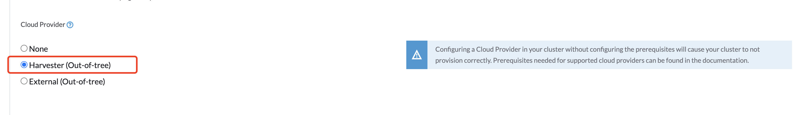
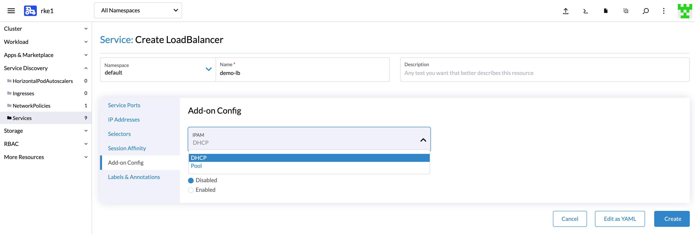
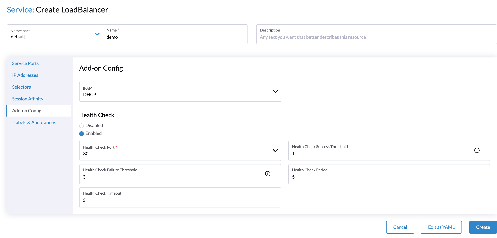

# Harvester Cloud Provider

[RKE1](./rke1-cluster.md) and [RKE2](./rke2-cluster.md) clusters can be provisioned in Rancher using the built-in Harvester Node Driver. Harvester provides [load balancer](./cloud-provider.md#load-balancer-support) and [cluster Persistent Storage](./csi-driver.md) support to the guest Kubernetes cluster.

In this page we will learn:

- How to deploy the Harvester cloud provider in both RKE1 and RKE2.
- How to use the [Harvester load balancer](./cloud-provider.md#load-balancer-support).

## Deploying

### Prerequisites
- The Kubernetes cluster is built on top of Harvester virtual machines.
- The Harvester virtual machines run as guest Kubernetes nodes are in the same namespace.

### Deploying to the RKE1 Cluster with Harvester Node Driver
When spinning up an RKE cluster using the Harvester node driver, you can perform two steps to deploy the `Harvester` cloud provider:

- Select `Harvester(Out-of-tree)` option.

    
  
- Install `Harvester Cloud Provider` from the Rancher marketplace.

    
  
!!!note 
    You should specify the `Cluster name`. The default value `kubernetes` will be set if no `Cluster name` is entered. The `Cluster name` is used to distinguish the ownership of the Harvester load balancers. 

- Install Harvester csi driver from the Rancher marketplace if needed.

    
  
### Deploying to the RKE2 Cluster with Harvester Node Driver
When spinning up an RKE2 cluster using the Harvester node driver, select the `Harvester` cloud provider. The node driver will then help deploy both the CSI driver and CCM automatically.

  

## Load Balancer Support
After deploying the `Harvester Cloud provider`, you can use the Kubernetes `LoadBalancer` service to expose a microservice inside the guest cluster to the external world. When you create a Kubernetes `LoadBalancer` service, a Harvester load balancer is assigned to the service and you can edit it through the `Add-on Config` in the Rancher UI.

  

### IPAM
Harvester's built-in load balancer supports both `pool` and `dhcp` modes. You can select the mode in the Rancher UI. Harvester adds the annotation `cloudprovider.harvesterhci.io/healthcheck-port` to the service behind.

- pool: You should configure an IP address pool in Harvester in advance. The Harvester LoadBalancer controller will allocate an IP address from the IP address pool for the load balancer.
  
   
  
- dhcp:  A DHCP server is required. The Harvester LoadBalancer controller will request an IP address from the DHCP server.

!!!note
    It is not allowed to modify the IPAM mode. You need to create a new service if you want to modify the IPAM mode.

### Health Checks
The Harvester load balancer supports TCP health checks. You can specify the parameters in the Rancher UI if you enable the `Health Check` option.

  

Alternatively, you can speficy the parameters by adding annotations to the service manually. The following annotations are supported:

| Annotation Key | Value Type | Required | Description |
|:---|:---|:---|:---|
| `cloudprovider.harvesterhci.io/healthcheck-port` | string | true | Specifies the port. The prober will access the address composed of the backend server IP and the port.
| `cloudprovider.harvesterhci.io/healthcheck-success-threshold` | string | false | Specifies the health check success threshold. The default value is 1. The backend server will start forwarding traffic if the number of times the prober continuously detects an address successfully reaches the threshold.
| `cloudprovider.harvesterhci.io/healthcheck-failure-threshold` | string | false | Specifies the health check failure threshold. The default value is 3. The backend server will stop forwarding traffic if the number of health check failures reaches the threshold.
| `cloudprovider.harvesterhci.io/healthcheck-periodseconds` | string | false |  Specifies the health check period. The default value is 5 seconds.
| `cloudprovider.harvesterhci.io/healthcheck-timeoutseconds` | string | false | Specifies the timeout of every health check. The default value is 3 seconds.

!!!note
    Currently, the health check port needs to be a `nodeport`. There's [a feature request](https://github.com/harvester/harvester/issues/1697) to change it to a service port and which will be implemented in a future release.
    