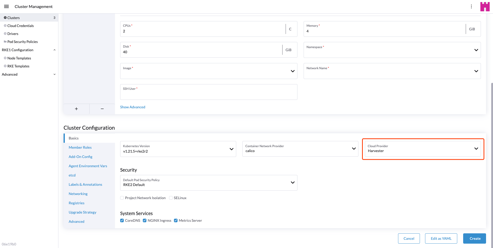

---
keywords:
  - Harvester
  - harvester
  - Rancher Integration
---

## Harvester CSI Driver

The Harvester Container Storage Interface (CSI) Driver provides a CSI interface used by guest kubernetes clusters in Harvester. It connects to the host cluster and hot-plug host volumes to the VMs to provide native storage performance.

## Deploying

### Prerequisites

- The Kubernetes cluster is built on top of Harvester virtual machines.
- The Harvester virtual machines running as guest Kubernetes nodes are in the same namespace.

### Deploying with Harvester RKE2 node driver

When spin up a kubernetes cluster using Rancher RKE2 node driver, the Harvester CSI driver will be deployed when harvester cloud provider is selected.



### Deploying with Harvester RKE1 node driver

1. Select the external cloud provider option.

2. [Generate addon configuration](https://github.com/harvester/harvester-csi-driver/blob/master/deploy/generate_addon.sh) and add it in the rke config yaml.

```
# depend on kubectl to operate the Harvester
./deploy/generate_addon.sh <serviceaccount name> <namespace>
```
