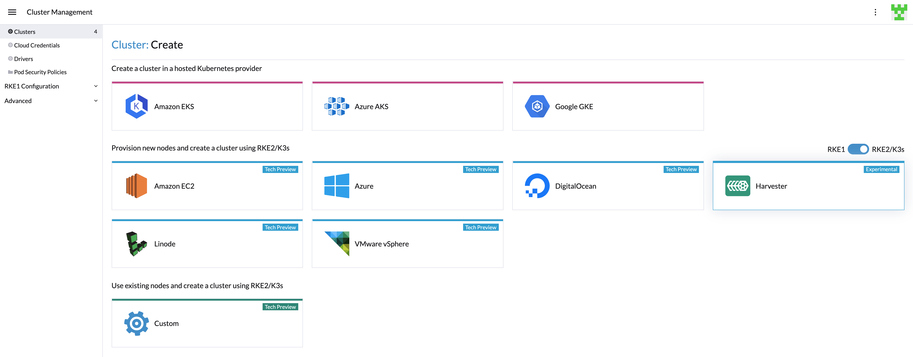
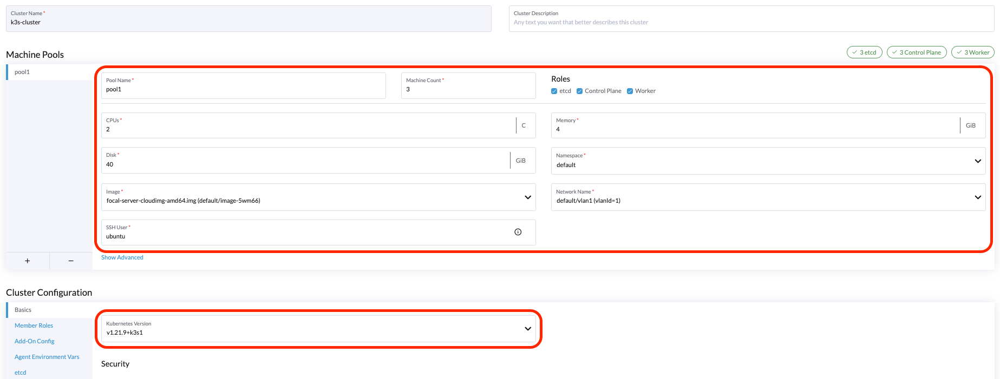

# Creating an K3s Kubernetes Cluster

You can now provision K3s Kubernetes clusters on top of the Harvester cluster in Rancher `v2.6.3+` using the built-in Harvester node driver.



!!! note
    - Harvester K3s node driver is in tech preview.
    - [VLAN network](https://docs.harvesterhci.io/v1.0/networking/harvester-network/#create-a-vlan-network) is required for Harvester node driver.

### Create Your Cloud Credentials

1. Click **☰ > Cluster Management**.
2. Click **Cloud Credentials**.
3. Click **Create**.
4. Click **Harvester**.
5. Enter your cloud credential name
6. Select "Imported Harvester" or "External Harvester".
7. Click **Create**.


###  Create K3s Kubernetes Cluster

You can create a K3s Kubernetes cluster from the **Cluster Management** page via the K3s node driver.

1. Select **Clusters** menu.
2. Click **Create** button.
3. Toggle Switch to **RKE2/K3s**.
4. Select Harvester node driver.
5. Select a **Cloud Credential**.
6. Enter **Cluster Name** (required).
7. Enter **Namespace** (required).
8. Enter **Image** (required).
9. Enter **Network Name** (required).
10. Enter **SSH User** (required).
11. Click **Create**.



### Using Harvester K3s Node Driver in Air Gapped Environment

K3s provisioning relies on the `qemu-guest-agent` to get the IP of the virtual machine. However, it may not be feasible to install `qemu-guest-agent` in an air gapped environment.

You can address the installation constraints with the following options:

Option 1. Use a VM image with `qemu-guest-agent` installed.

Option 2. Configure the `cloud init` user data to enable the VMs to install `qemu-guest-agent` via an HTTP(S) proxy.

Example of `user data` in Harvester node template:
```
#cloud-config
apt:
  http_proxy: http://192.168.0.1:3128
  https_proxy: http://192.168.0.1:3128
```
