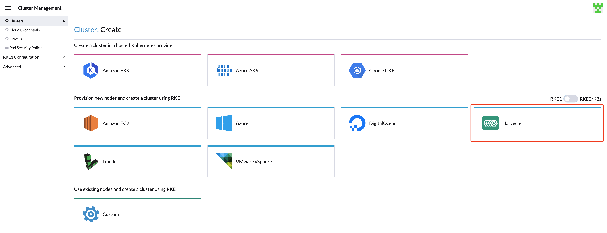

# Harvester Node Driver

The Harvester node driver is used to provision VMs in the Harvester cluster. In this section, you'll learn how to configure Rancher to use the Harvester node driver to launch and manage Kubernetes clusters.

A node driver is the same as a [Docker Machine driver](https://docs.docker.com/machine/), and the project repo is available at [harvester/docker-machine-driver-harvester](https://github.com/harvester/docker-machine-driver-harvester).

You can now provision RKE1/RKE2 Kubernetes clusters in Rancher `v2.6.3+` with the built-in Harvester node driver. 
Additionally, Harvester now can provide built-in [Load Balancer support](./cloud-provider.md) as well as raw cluster [persistent storage](./csi-driver.md) support to the guest Kubernetes cluster.

!!!note
    Harvester v1.0.0 is compatible with Rancher `v2.6.3+` only.

## Harvester Node Driver

The Harvester node driver is enabled by default in Rancher `v2.6.3+`. You can go to `Cluster Management > Drivers > Node Drivers` page to manage the Harvester node driver manually.

When the Harvester node driver is enabled, you can create Kubernetes clusters on top of the Harvester cluster and manage them from Rancher.

## RKE1 Kubernetes Cluster
Click to learn [how to create RKE1 Kubernetes Clusters](./rke1-cluster.md).

## RKE2 Kubernetes Cluster
Click to learn [how to create RKE2 Kubernetes Clusters](./rke2-cluster.md).
