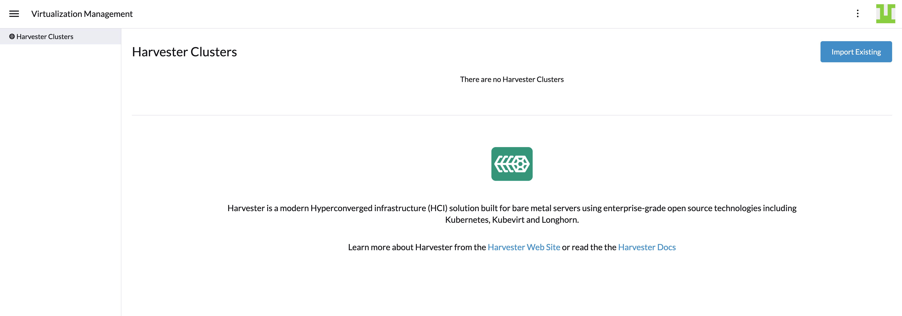

## Rancher Integration

_Available as of v0.3.0_

[Rancher](https://github.com/rancher/rancher) is an open-source multi-cluster management platform. Harvester has made an integration with Rancher(start from v2.6.1) on its HCI mode.

Users can now import and manage multiple Harvester clusters using Rancher `v2.6.1` Virtualization Management feature and leverage Rancher [authentication](https://rancher.com/docs/rancher/v2.6/en/admin-settings/authentication/) mechanism and RBAC control for [multi-tenancy](https://rancher.com/docs/rancher/v2.6/en/admin-settings/rbac/) support.



## Deploy Rancher

Previously in Harvester v0.2.0, we've provided the option to enable the embedded Rancher server. This option has been removed from Harvester `v0.3.0`. 

To use Rancher with Harvester, please install Rancher v2.6.1 separately from Harvester. You can spin up a VM with Rancher v2.6.1 to try out the integration features.

### Quick Start Guide
1. Begin creation of a custom cluster by provisioning a Linux host. Your host can be:
    - A cloud-host virtual machine (VM)
    - An on-prem VM
    - A bare-metal server
1. Log in to your Linux host using your preferred shell, such as PuTTy or a remote Terminal connection.
1. From your shell, enter the following command:

```shell
# for a quick evaluation, you can run the Rancher server with the following command
$ sudo docker run -d --restart=unless-stopped -p 80:80 -p 443:443 --privileged rancher/rancher:v2.6.1
```

!!! Note
    For more detail about how to deploy the Rancher server, please refer to the Rancher [doc](https://rancher.com/docs/rancher/v2.6/en/quick-start-guide/deployment/)

## Virtualization Management

With Rancher's Virtualization Management, users can now import and manage the Harvester clusters, by click one of the cluster, user was able to view manage the downstream Harvester resources e.g like VMs, images, volumes and so on. 
Additionally, it has leveraged the Rancher existing features like authentication with various auth providers and multi-tenant support.

For more details please reference the [virtualization management](virtualization-management.md) page.


!!!note
    Virtualization Management is in Tech Preview.

## Creating K8s Clusters using the Harvester Node Driver

[Harvester node driver](node-driver.md) is used to provision VMs in the Harvester cluster, which Rancher uses to launch and manage Kubernetes clusters.

Starting from Rancher `v2.6.1`, the Harvester node driver has been added by default. Users can reference this [doc](node-driver.md) for more details.

!!!note
    Harvester Node Driver is in Tech Preview.
