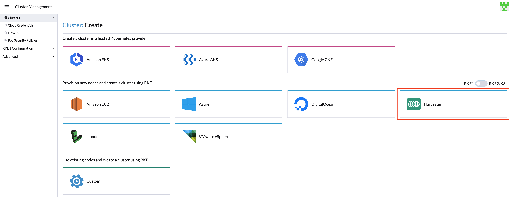
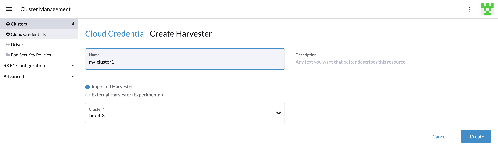
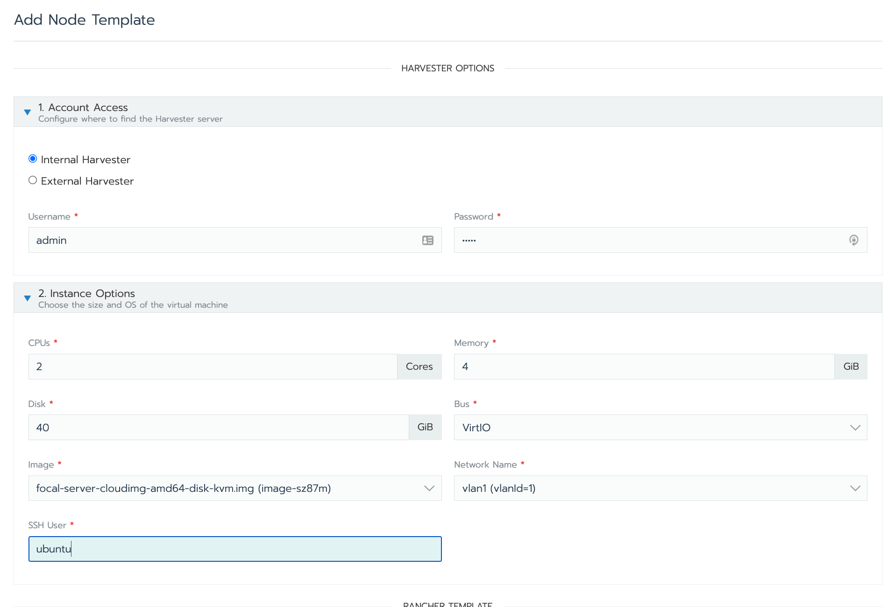
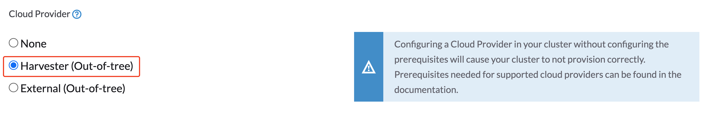

# Creating an RKE1 Kubernetes Cluster

You can now provision RKE1 Kubernetes clusters on top of the Harvester cluster in Rancher `v2.6.3+` with the built-in Harvester node driver.



!!! note
      - VLAN network is required for Harvester node driver.

When you create a Kubernetes cluster hosted by the Harvester infrastructure, [node templates](https://rancher.com/docs/rancher/v2.6/en/cluster-provisioning/rke-clusters/node-pools/#node-templates) are used to provision the cluster nodes. These templates use Docker Machine configuration options to define an operating system image and settings/parameters for the node.

Node templates can use `cloud credentials` to access the credentials information required to provision nodes in the infrastructure providers. The same `cloud credentials` can be used by multiple node templates. By using `cloud credentials`, you do not have to re-enter access keys for the same cloud provider. `Cloud credentials` are stored as Kubernetes secrets.

You can create `cloud credentials` in two contexts:

- [During the creation of a node template](https://rancher.com/docs/rancher/v2.6/en/cluster-provisioning/rke-clusters/node-pools/#node-templates) for a cluster.
- In the User Settings page

All `cloud credentials` are bound to your user profile and cannot be shared with other users.

### Create Your Cloud Credentials

1. Click **☰ > Cluster Management**.
1. Click **Cloud Credentials**.
1. Click **Create**.
1. Click **Harvester**.
1. Enter your cloud credential name.
1. Select "Imported Harvester" or "External Harvester".
1. Click **Create**.



### Create Node Template 

You can use the Harvester node driver to create node templates and eventually node pools for your Kubernetes cluster.

1. Configure the  **Cloud Credentials**.
1. Configure **Instance Options**:
    * Configure the CPU, memory, and disk
    * Select an OS image that is compatible with the `cloud-init` config.
    * Select a network that the node driver is able to connect to; currently, only `VLAN` is supported.
    * Enter the SSH User; the username will be used to ssh to nodes. For example, a default user of the Ubuntu cloud image will be `ubuntu`.
1. (Optional) Configure **Advanced Options** if you want to customise the cloud-init config of the VMs:
1. Enter a **RANCHER TEMPLATE** name.



See [nodes hosted by an infrastructure provider](https://rancher.com/docs/rancher/v2.6/en/cluster-provisioning/rke-clusters/node-pools/) for more information.

### Create RKE1 Kubernetes Cluster

Users can create an RKE1 Kubernetes cluster from the **Cluster Management** page via the Harvester RKE1 node driver.

1. Select **Clusters** menu.
1. Click **Create** button.
1. Toggle Switch to **RKE1**.
1. Select Harvester node driver.
1. Enter **Cluster Name** (required).
1. Enter **Name Prefix** (required).
1. Enter **Template** (required).
1. Select **etcd** and **Control Plane** (required).
1. On the **Cluster Options** configure `Cloud Provider` to `Harvester` if you want to use the Harvester [Cloud Provider](/rancher/cloud-provider) and [CSI Diver](/rancher/csi-driver).
   
1. Click **Create**.


### Using Harvester RKE1 Node Driver in Air Gapped Environment

RKE1 provisioning relies on the `qemu-guest-agent` to get the IP of the virtual machine, and `docker` to set up the RKE cluster. However, It may not be feasible to install `qemu-guest-agent` and `docker` in an air gapped environment.

You can address the installation constraints with the following options:

Option 1. Use a VM image with `qemu-guest-agent` and `docker` installed.

Option 2. Configure the `cloud init` user data to enable the VMs to install `qemu-guest-agent` and `docker` via an HTTP(S) proxy.

Example user data in Harvester node template:
```
#cloud-config
apt:
  http_proxy: http://192.168.0.1:3128
  https_proxy: http://192.168.0.1:3128
write_files:
- path: /etc/environment
  content: |
    HTTP_PROXY="http://192.168.0.1:3128"
    HTTPS_PROXY="http://192.168.0.1:3128"
  append: true
```
