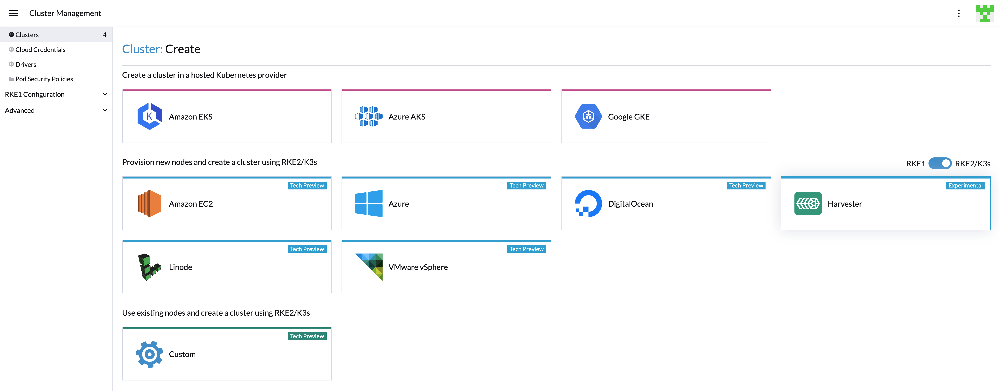

# RKE2 Kubernetes Cluster

Users can now provision RKE2 Kubernetes clusters on top of the Harvester cluster in Rancher `v2.6.1` using the built-in Harvester Node Driver.

!!! note
    - Harvester RKE2 node driver is in tech preview.
    - VLAN network is required for Harvester node driver.

### Create Your Cloud Credentials

1. Click **☰ > Cluster Management**.
2. Click **Cloud Credentials**.
3. Click **Create**.
4. Click **Harvester**.
5. Enter your cloud credential name
6. Select "Imported Harvester" or "External Harvester"
7. Click **Create**.

###  Create RKE2 Kubernetes Cluster

Users can create a RKE2 Kubernetes cluster from the **Cluster Management** page via RKE2 node driver.

1. Select **Clusters** menu.
2. Click **Create** button.
3. Toggle Switch to **RKE2/K3s**.
4. Select Harvester node driver.
5. Select a **Cloud Credential**.
6. **Cluster Name** is required.
7. **Namespace** is required.
8. **Image** is required.
9. **Network Name** is required.
10. **SSH User** is required.

!!! note
    With RKE2 v1.21.5+rke2r2 or above, it provides a built-in Harvester Cloud Provider and Guest CSI driver integration

    - currently only imported Harvester cluster is supported automatically
