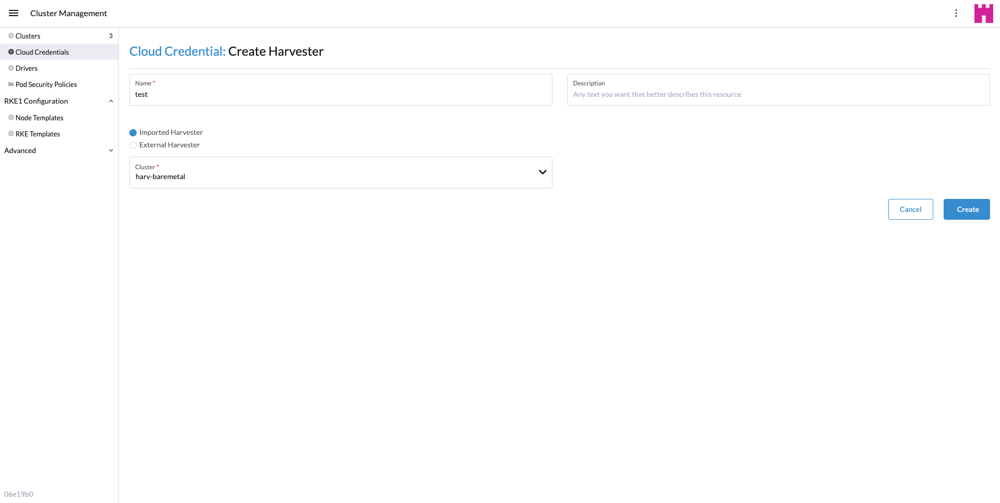

# Create a harvester cluster

## Create your cloud credentials

1. Click **☰ > Cluster Management**.
2. Click **Cloud Credentials**.
3. Click **Create**.
4. Click **Harvester**.
5. Enter your cloud credential name
6. Select "Imported Harvester" or "External Harvester"
7. Click **Create**.

## How to create a harvester cluster

Create a harvester cluster from the **Cluster Management** page.

1. Select **Clusters** menu.
2. Click **Create** button.
3. Toggle Switch to **RKE2/K3s**.
4. Select Harvester node driver.
5. Select a **Cloud Credential**.
6. **Cluster Name** is required.
7. **Namespace** is required.
8. **Image** is required.
9. **Network Name** is required.
10. **SSH User** is required.
  

