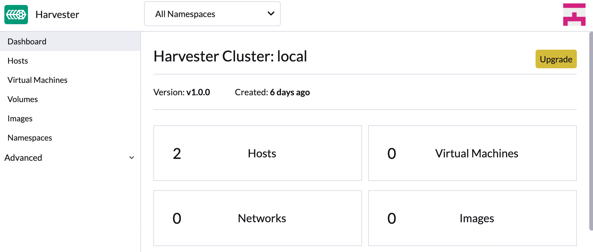

# Upgrading Harvester

This document describes how to upgrade from Harvester `v1.0.0` to `v1.0.1`.

Note we are still working towards zero-downtime upgrade, due to some known issues please follow the steps below before you upgrade your Harvester cluster at this moment:

!!!warning

    - Before you upgrade your Harvester cluster, we highly recommend:
        - Shutting down all your VMs (Harvester GUI -> Virtual Machines -> Select VMs -> Actions -> Stop).
        - Back up your VMs.
    - Do not operate the cluster during an upgrade. For example, creating new VMs, uploading new images, etc.
    - Make sure your hardware meets the **preferred** [hardware requirements](../index.md#hardware-requirements). This is due to there will be intermediate resources consumed by an upgrade.
    - Make sure each node has at least 25 GB of free space (`df -h /usr/local/`).

## Create a version

- Log in to one of your server nodes.
- Become root and create a version:
    ```
    rancher@node1:~> sudo -i

    node1:~ # cat > version.yaml <<EOF
    apiVersion: harvesterhci.io/v1beta1
    kind: Version
    metadata:
      name: v1.0.1-rc2
      namespace: harvester-system
    spec:
      isoChecksum: 2e8233e99589f735253255ccbe5ed039a37000f6766233fdb2dba5255180d27c8f8116548c8ba5b1b46a4dd605a3ffbe0284e59a912a50c5a6586957fa4e71d3
      isoURL: https://releases.rancher.com/harvester/v1.0.1-rc2/harvester-v1.0.1-rc2-amd64.iso
      releaseDate: "20220331"
    EOF

    node1:~ # kubectl create -f version.yaml
    version.harvesterhci.io/1.0.1-rc2 created
    ```

!!!note

    The user can also download the ISO file to a local HTTP server and subsitute the `isoURL` value in the `version.yaml` manifest.

**TODO**: publish this manifest so the user can apply it directly.

## Start a upgrade

- Make sure to read the Warning paragraph at the top of this document first.
- Navigate to Harvester GUI, click the upgrade button on the Dashboard page.

    

- Select a version to start upgrading.

    {: style="width:50%"}

- Click the circle on the top to display the upgrade progress.
    

## Known issues

### Stuck in **Upgrading System Service**

- **Description**
    - The upgrade is stuck at **Upgrading System service**.
    - Similar logs are found in rancher pods:

        ```
        [ERROR] available chart version (100.0.2+up0.3.8) for fleet is less than the min version (100.0.3+up0.3.9-rc1) 
        [ERROR] Failed to find system chart fleet will try again in 5 seconds: no chart name found
        ```

- **Workaround**

    Delete rancher cluster repositories and restart rancher pods.

      ```
      # login to a server node and become root first
      kubectl delete clusterrepos.catalog.cattle.io rancher-charts
      kubectl delete clusterrepos.catalog.cattle.io rancher-rke2-charts
      kubectl delete clusterrepos.catalog.cattle.io rancher-partner-charts
      kubectl delete settings.management.cattle.io chart-default-branch
      kubectl rollout restart deployment rancher -n cattle-system
      ```

- **Related issues**
    - [[BUG] Rancher upgrade fail: Failed to find system chart "fleet"](https://github.com/harvester/harvester/issues/2011)


### VMs fail to migrate

- **Description**
    - A node keeps waiting in `Pre-draining` state.
    - There are VMs on that node (checking for `virt-launcher-xxx` pods) and they can't be live-migrated out of the node.

- **Workaround**

    Shutdown the VMs, you can do this by:

      - Using the GUI.
      - Using the `virtctl` command.

- **Related issues**
    - [[BUG] Upgrade: VMs fail to live-migrate to other hosts in some cases](https://github.com/harvester/harvester/issues/2029)

### fleet-local/local: another operation (install/upgrade/rollback) is in progress 

- **Description**

    You see bundles have `fleet-local/local: another operation (install/upgrade/rollback) is in progress` status in the output:

    ```
    kubectl get bundles -A
    ```

- **Related issues**
    - [[BUG] Upgrade: rancher-monitoring charts can't be upgraded](https://github.com/harvester/harvester/issues/1983)
