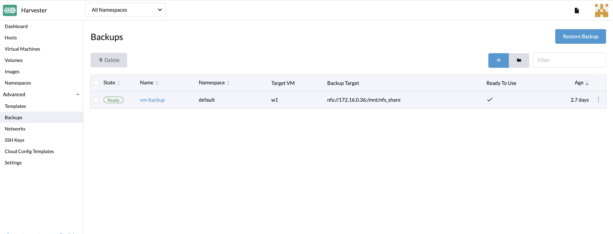
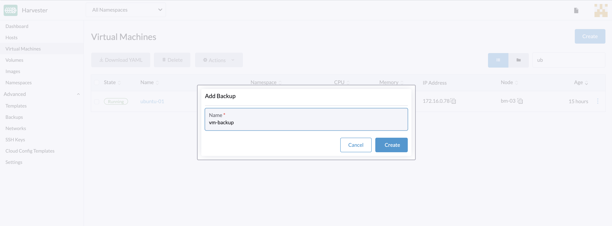
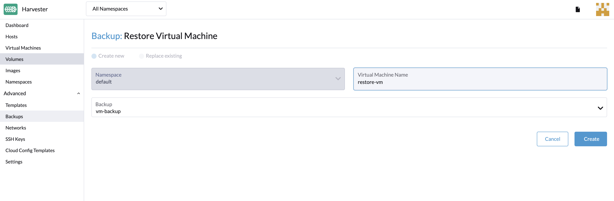

# VM Backup & Restore

_Available as of v0.3.0_

VM backups are created from the **Virtual Machines** page. The VM backup volumes will be stored in the **Backup Target** (an NFS or S3 server), and they can be used to either restore a new VM or replace an existing VM.

!!! Note
    A backup target must be set up. For more information, see [Configure Backup Target](#configure-backup-target). If the backup target has not been set, you’ll be prompted with a message to do so.

## Configure Backup Target

A backup target is an endpoint used to access a backup store in Harvester. A backup store is an NFS server or S3 compatible server that stores the backups of VM volumes. The backup target can be set at `Settings > backup-target`.

| Parameter          | Type   | Description                                                                              |
| :----------------- | :----- | :--------------------------------------------------------------------------------------- |
| Type               | string | Choose S3 or NFS                                                                         |
| Endpoint           | string | A hostname or an IP address. It can be left empty for AWS S3.                |
| BucketName         | string | Name of the bucket                                                                       |
| BucketRegion       | string | Region of the bucket                                                                     |
| AccessKeyID        | string | A user-id that uniquely identifies your account                     |
| SecretAccessKey    | string | The password to your account                                         |
| Certificate        | string | Paste to use a self-signed SSL certificate of your S3 server |
| VirtualHostedStyle | bool   | Use `VirtualHostedStyle` access only; e.g., Alibaba Cloud (Aliyun) OSS                    |

## Create a VM backup

1. Once the backup target is set, go to the `Virtual Machines` page.
1. Click `Take Backup` of the VM actions to create a new VM backup.
1. Set a custom backup name and click `Create` to create a new VM backup.

**Result:** The backup is created. You will receive a notification message, and you can also go to the `Advanced > Backups` page to view all VM backups.

The `ReadyToUse` status will be set to `true` once the Backup is complete.

Users can either choose to restore a new VM or replace an existing VM using this backup.

## Restore a new VM using a backup

To restore a new VM from a backup, follow these steps:

1. Go to the `Backups` page.
1. Specify the new VM name and click `Create`.
1. A new VM will be restored using the backup volumes and metadata, and you can access it from the `Virtual Machines` page.

## Replace an Existing VM using a backup

You can replace an existing VM using the backup with the same VM backup target.

You can choose to either delete or retain the previous volumes. By default, all previous volumes are deleted.

**Requirements:** The VM must exist and is required to be in the powered-off status.

1. Go to the `Backups` page.
1. Click `Create`.

The restore process can be viewed from the `Virtual Machines` page.
