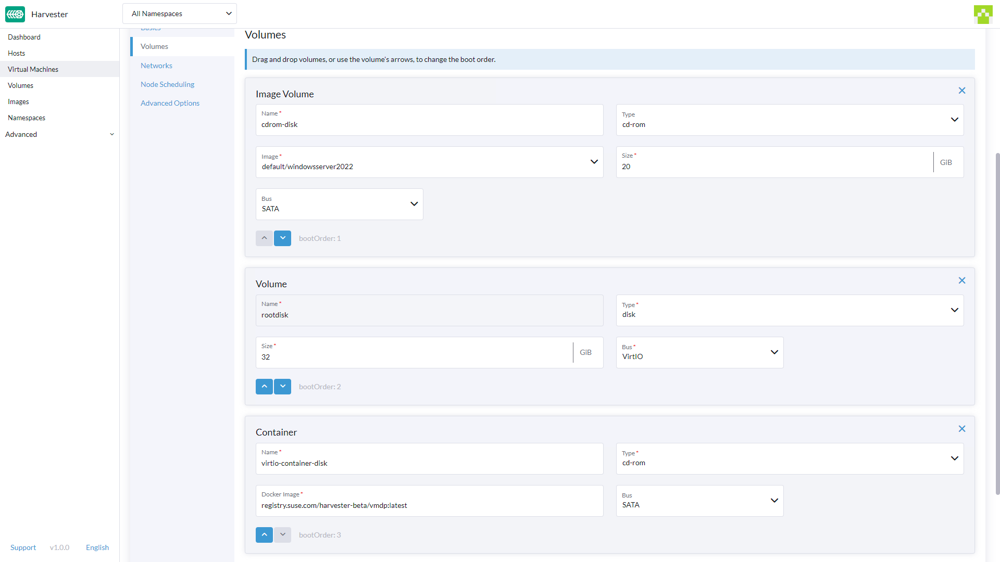
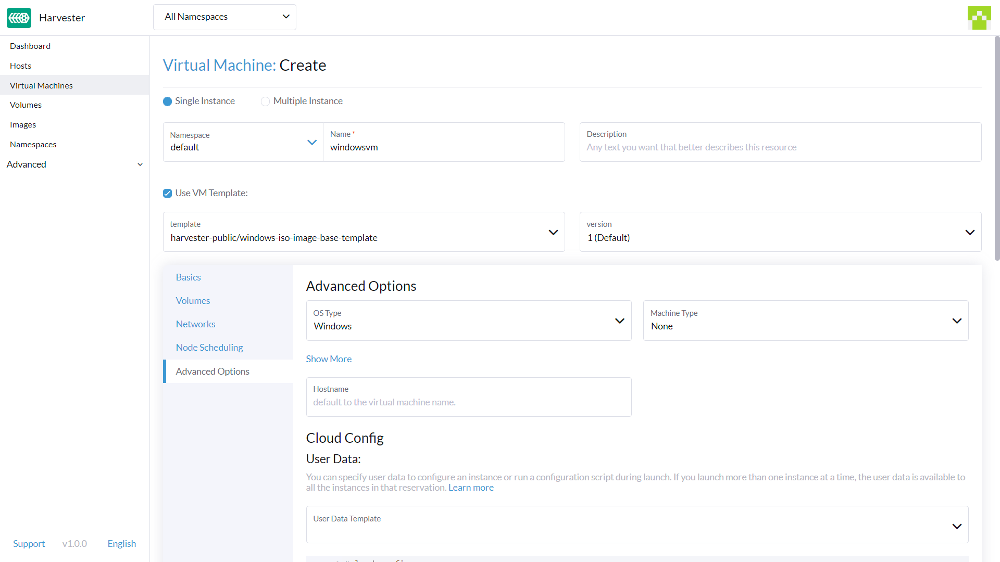

# Create a Windows Virtual Machine

Create one or more virtual machines from the **Virtual Machines** page.

!!! note
	For creating Linux virtual machines, please refer to [this page](./create-vm.md).

## Header Section

1. Create a single VM instance or multiple VM instances.
1. Set the VM name.
1. [Optional] Provide a description for the VM.
1. [Optional] Select the VM template `windows-iso-image-base-template`. This template will add a volume with the `virtio` drivers for Windows.

## Basics Tab

1. Configure the number of `CPU` cores assigned to the VM.
1. Configure the amount of `Memory` assigned to the VM.
1. [Optional] Select existing `SSH keys` or upload new ones.

!!! note
    As mentioned above, it is recommended that you use the Windows VM template. The `Volumes` section will describe the options which the Windows VM template created automatically.

!!! warning
	The `bootOrder` values need to be set with the installation image first. If you change it, your VM might not boot into the installation disk.

## Volumes Tab

1. The **first volume** is an `Image Volume` with the following values: 
    1. `Name`: The value `cdrom-disk` is set by default. You can keep it or change it.
    2. `Image`: Select the Windows image to be installed. See [Upload Images](/upload-image/) for the full description on how to create new images.
    3. `Type`: Select `cd-rom`.
    4. `Size`: The value `20` is set by default. You can change it if your image has a bigger size.
    5. `Bus`: The value `SATA` is set by default. It's recommended you don't change it.
2. The **second volume** is a `Volume` with the following values:
    1.  `Name`: The value `rootdisk` is set by default. You can keep it or change it.
    2.  `Size`: The value `32` is set by default. See the disk space requirements for [Windows Server](https://docs.microsoft.com/en-us/windows-server/get-started/hardware-requirements#storage-controller-and-disk-space-requirements) and [Windows 11](https://docs.microsoft.com/en-us/windows/whats-new/windows-11-requirements#hardware-requirements) before changing this value.
    3.  `Bus`: The value `VirtIO` is set by default. You can keep it or change it to the other available options, `SATA` or `SCSI`.
3. The **third volume** is a `Container` with the following values:
    1. `Name`: The value `virtio-container-disk` is set by default. You can keep it or change it.
    2. `Docker Image`: The value `registry.suse.com/suse/vmdp/vmdp:2.5.3` is set by default. It's recommended you don't change it.
    3. `Bus`: The value `SATA` is set by default. It's recommended you don't change it.
4. You can add additional disks using the buttons `Add Volume`, `Add Existing Volume`, `Add VM Image`, or `Add Container`.

## Networks Tab

1. The **Management Network** is added by default with the following values: 
    1. `Name`:  The value `default` is set by default. You can keep it or change it.
    2. `Network`: The value `management Network` is set by default. You can't change this option if no other network has been created. See [Harvester Network](/networking/harvester-network/) for the full description on how to create new networks.
    3. `Model`: The value `e1000` is set by default. You can keep it or change it to the other available options from the dropdown.
    4. `Type`: The value `masquerade` is set by default. You can keep it or change it to the other available option, `bridge`.
2. You can add additional networks by clicking  `Add Network`.

!!! warning
	Changing the `Node Scheduling` settings can impact Harvester features, such as disabling `Live migration`.

## Node Scheduling Tab

1. `Node Scheduling` is set to `Run VM on any available node` by default. You can keep it or change it to the other available options from the dropdown.

## Advanced Options Tab

1. `OS Type`: The value `Windows` is set by default. It's recommended you don't change it.
2. `Machine Type`: The value `None` is set by default. It's recommended you don't change it. See the [KubeVirt Machine Type](https://kubevirt.io/user-guide/virtual_machines/virtual_hardware/#machine-type) documentation before you change this value.
3. [Optional] `Hostname`: Set the VM hostname.
4. [Optional] `Cloud Config`: Both `User Data` and `Network Data` values are set with default values. Currently, these configurations are not applied to Windows-based VMs.

## Footer Section

1. `Start virtual machine on creation`: This option is checked by default. You can uncheck it if you don't want the VM to start once it's created.

Once all the settings are in place, click on `Create` to create the VM.

!!! note
    If you need to add advanced settings, you can edit the VM configuration directly by clicking on `Edit as YAML`. 
    And if you want to cancel all changes made, click `Cancel`.
