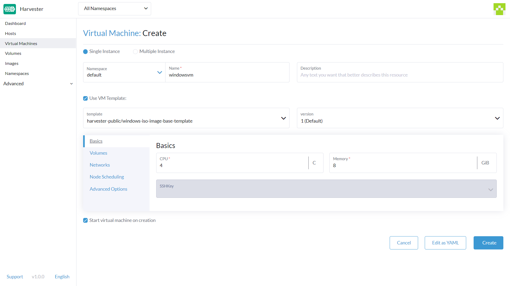

# Create a Windows VM

Create one or more virtual machines from the **Virtual Machines** page.

!!! note
	For creating Linux virtual machines, please refer to [this page](./create-vm.md)

## Header

* In the `header` section, you have the following options:

    1. Create a single or multiple VM instances.
    1. Set the VM name.
    1. [Optional] Provide a description for the VM.
    1. [Optional] Select the VM template `windows-iso-image-base-template`. This template will add a volume with the `virtio` drivers for Windows.

## Tab: Basics
* In the `Basics` tab, you have the following options:

    1. Configure the number of `CPU` assigned to the VM.
    1. Configure the amount of `Memory` assigned to the VM.
    1. [Optional] Select an existing `SSH keys` or upload new ones.

    

!!! note
	As mentioned above, the recommended option is to use the Windows VM template. The `Volumes` section will describe the options which the Windows VM template created automatically.

!!! warning
	The `bootOrder` values need to be set with the installation image first. If you change it, your VM might not boot into the installation disk.

## Tab: Volumes
* In the `Volumes` tab, you have the following options:

    1. The **first volume** is an `Image Volume` with the following values: 
        1. `Name`: The value `cdrom-disk` is set by default. You can keep it or change it.
        2. `Image`: Select the Windows image to be installed. See [Upload Images](/upload-image/) for the full description on how to create new images.
        3. `Type`: Select `cd-rom`.
        4. `Size`: The value `20` is set by default. You can change it if your image has a bigger size.
        5. `Bus`: The value `SATA` is set by default. It's recommended you don't change it.
    2. The **second volume** is a `Volume` with the following values:
        1.  `Name`: The value `rootdisk` is set by default. You can keep it or change it.
        2.  `Size`: The value `32` is set by default. See the disk space requirements for [Windows Server](https://docs.microsoft.com/en-us/windows-server/get-started/hardware-requirements#storage-controller-and-disk-space-requirements) and [Windows 11](https://docs.microsoft.com/en-us/windows/whats-new/windows-11-requirements#hardware-requirements) before changing this value.
        3.  `Bus`: The value `VirtIO` is set by default. You can keep it or change it to the other available options, `SATA` or `SCSI`.
    3. The **third volume** is a `Container` with the following values:
        1. `Name`: The value `virtio-container-disk` is set by default. You can keep it or change it.
        2. `Docker Image`: The value `registry.suse.com/harvester-beta/vmdp:latest` is set by default. It's recommended you don't change it.
        3. `Bus`: The value `SATA` is set by default. It's recommended you don't change it.
    4. You can add additional disks using the buttons `Add Volume`, `Add Existing Volume`, `Add VM Image`, `Add Container`.

    

## Tab: Networks
* In the `Networks` tab, you have the following options:

    1. The **Management Network** is added by default with the following values: 
        1. `Name`:  The value `default` is set by default. You can keep it or change it.
        2. `Network`: The value `management Network` is set by default. You can't change this option if there's no other network created. See [Harvester Network](/networking/harvester-network/) for the full description on how to create new networks.
        3. `Model`: The value `e1000` is set by default. You can keep it or change it to the other available options.
        4. `Type`: The value `masquerade` is set by default. You can keep it or change it to the other available option, `bridge`.
    2. You can add additional using the button `Add Network`.

    

!!! warning
	Changing the `Node Scheduling` settings can impact Harvester features, such as the `Live migration`.
	

## Tab: Node Scheduling
* On the `Node Scheduling` tab, you have the following option:

    1. The `Node Scheduling` is set to `Run VM on any available node` by default. You can keep it or change it to the other available options.

     

## Tab: Advanced Options
* In the `Advanced Options` tab, you have the following options:

    1. `OS Type`: The value `Windows` is set by default. It's recommended you don't change it.
    2. `Machine Type`: The value `None` is set by default. It's recommended you don't change it. See the [KubeVirt Machine Type](https://kubevirt.io/user-guide/virtual_machines/virtual_hardware/#machine-type) documentation, before you change this value.
    3. [Optional] `Hostname`: Set the VM hostname.
    4. [Optional] `Cloud Config`: Both `User Data` and `Network Data` values are set with default values. Currently, these configurations are not applied to Windows based VMs.

     

## Footer
* In the `footer` section, you have the following options:

    1. `Start virtual machine on creation`: This option is checked by default. You can uncheck it if you don't want the VM to start once it's created.

Once all the settings are set, you can create the VM by clicking on `Create`. 

!!! note
    If you need to add advanced settings, you can edit the VM configuration directly by click on `Edit as YAML`. 
    And if you want to cancel all changes made, click `Cancel`.