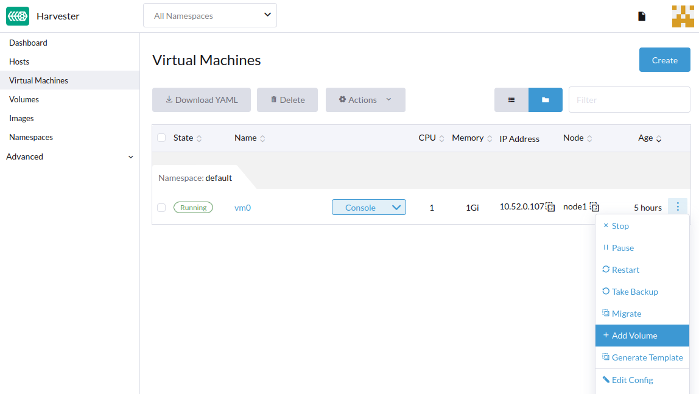

# Hot-Plug Volumes

Harvester supports adding hot-plug volumes to a running VM.

## Adding hot-plug volumes to a running VM

The following steps assume that you have a running VM and a ready volume.

1. Go to the **Virtual Machines** page.
1. Find the VM that you want to add a volume to and select **Vertical ⋮ (… ) > Add Volume**.
1. Enter the **Name** and select the **Volume**.
1. Click **Apply**.

