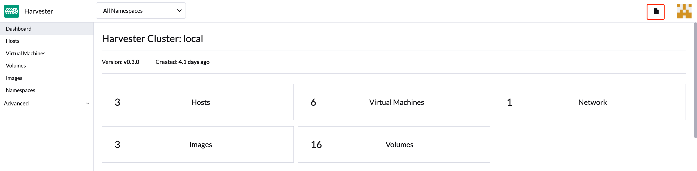

# FAQ

This FAQ is a work in progress designed to answer the questions our users most frequently ask about Harvester.

1. How can I ssh login to the Harvester node?
```shell
$ ssh rancher@node-ip
```

1. What is the default login username and password of the Harvester dashboard?
```shell
username: admin
password: # you will be promoted to set the default password when logging in for the first time
```

1. How can I access the kubeconfig file of the Harvester cluster?
```shell
# You can either download the kubeconfig file from the Harvester 
# dashboard or access it via one of the Harvester management nodes. E.g.,
$ cat /etc/rancher/rke2/rke2.yaml
```


1. How do I access the embedded Rancher dashboard?

    Please refer to the [troubleshooting section](/troubleshooting/harvester#access-embedded-rancher).

1. How to install the qemu-guest-agent of a running VM.
```shell
# cloud-init will only be executed once, reboot it after add the cloud-init config with the following command.
$ cloud-init clean --logs --reboot
```
[https://cloudinit.readthedocs.io/en/latest/topics/cli.html#clean](https://cloudinit.readthedocs.io/en/latest/topics/cli.html#clean)
