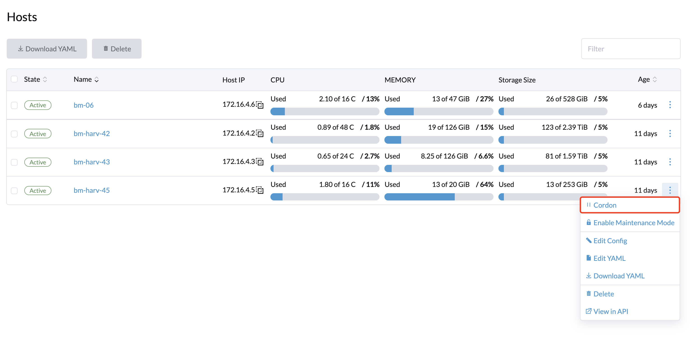

# Host Management

Users can view and manage Harvester nodes from the host page. The first node always defaults to be a management node of the cluster. When there are more than three nodes, the two other nodes that first joined are automatically promoted to management nodes to form a HA cluster.

:::note

Because Harvester is built on top of Kubernetes and uses etcd as its database, the maximum node fault toleration is one when there are three management nodes.

:::

## Node Maintenance

For admin users, you can click **Enable Maintenance Mode** to evict all VMs from a node automatically. It will leverage the `VM live migration` feature to migrate all VMs to other nodes automatically. Note that at least two active nodes are required to use this feature.

## Cordoning a Node

Cordoning a node marks it as unschedulable. This feature is useful for performing short tasks on the node during small maintenance windows, like reboots, upgrades, or decommissions. When you’re done, power back on and make the node schedulable again by uncordoning it.

## Multi-disk Management - `Tech Preview`

Users can view and add multiple disks as additional data volumes from the host detail page.

1. Go to the **Hosts** page.
2. On the node you want to modify, click **⋮ > Edit Config**.
2. Select the **Disks** tab and click **Add Disks**.
3. Select either an additional raw block device or partition to add as an additional data volume.
    - The `Force Formatted` option is required when adding an entire raw block device to form a single root disk partition using the ext4 filesystem.
    - The `Force Formatted` option is optional when adding partitions where the filesystem type is `ext4`, `XFS` or cannot be found. It is required when adding partitions of any other filesystem type.

