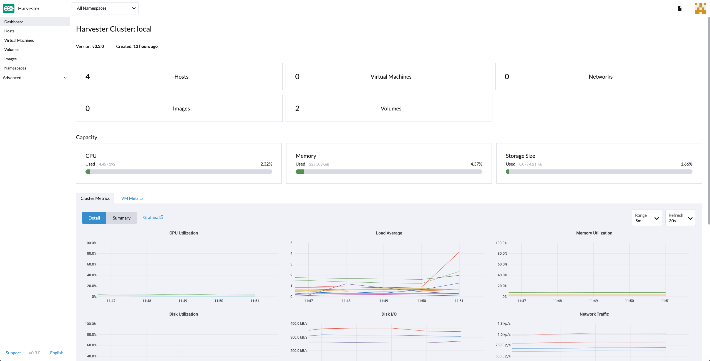

# Harvester Overview

Harvester is an open-source [hyper-converged infrastructure](https://en.wikipedia.org/wiki/Hyper-converged_infrastructure) (HCI) software built on Kubernetes. It is an open alternative to using a proprietary HCI stack that incorporates the design and ethos of [Cloud Native Computing](https://en.wikipedia.org/wiki/Cloud_native_computing).

## Harvester Features

Harvester implements HCI on bare metal servers. Harvester is designed to use local, direct attached storage instead of complex external SANs. It ships as an integrated bootable appliance image that can be deployed directly to servers through an ISO or PXE boot artifact.

Some notable features of Harvester include the following:

1. VM lifecycle management including SSH-Key injection, cloud-init, and graphic and serial port console
1. VM live migration support
1. Supported VM backup and restore
1. Distributed block storage
1. Multiple network interface controllers (NICs) in the VM connecting to the management network or VLANs
1. Virtual Machine and cloud-init templates
1. [Rancher](https://github.com/rancher/rancher) integration with multi-cluster management and the Harvester node driver
1. [PXE/iPXE boot support](https://docs.harvesterhci.io/latest/install/pxe-boot-install)
1. Virtual IP and bond NIC support
1. Monitoring integration

## Harvester Architecture
The following diagram outlines a high-level architecture of Harvester:

- [Longhorn](https://longhorn.io/) is a lightweight, reliable and easy-to-use distributed block storage system for Kubernetes.
- [KubeVirt](https://kubevirt.io/) is a virtual machine management add-on for Kubernetes.
- [Elemental for openSUSE Leap 15.3](https://github.com/rancher-sandbox/cOS-toolkit) is a Linux distribution designed to remove as much OS maintenance as possible in a Kubernetes cluster.

## Hardware Requirements

To get the Harvester server up and running, the following minimum hardware is required:

| Type | Requirements |
|:---|:---|
| CPU | x86_64 only. Hardware-assisted virtualization is required. 8-core processor minimum; 16-core or above preferred |
| Memory | 32 GB minimum; 64 GB or above preferred |
| Disk Capacity |  140 GB minimum; 500 GB or above preferred |
| Disk Performance |  5,000+ random IOPS per disk (SSD/NVMe). Management nodes (first three nodes) must be [fast enough for etcd](https://www.ibm.com/cloud/blog/using-fio-to-tell-whether-your-storage-is-fast-enough-for-etcd). |
| Network Card | 1 Gbps Ethernet minimum; 10Gbps Ethernet recommended |
| Network Switch | Trunking of ports required for VLAN support |

## Quick Start

You can install Harvester via ISO installation or PXE Boot Installation. Instructions are provided in sections below.

### ISO Installation

You can use the ISO to install Harvester directly on the bare metal server to form a Harvester cluster. Users can add one or many compute nodes to join the existing cluster.

To get the Harvester ISO, download it from the [Github releases](https://github.com/harvester/harvester/releases).

During the installation, you can either choose to form a new cluster or join the node to an existing cluster.

**Note:** This [video](https://youtu.be/97ADieBX6bE) shows a brief overview of the ISO installation process.

<iframe width="950" height="475" src="https://www.youtube.com/embed/97ADieBX6bE" title="YouTube video player" frameborder="0" allow="accelerometer; autoplay; clipboard-write; encrypted-media; gyroscope; picture-in-picture" allowfullscreen></iframe>

1. Mount the Harvester ISO disk and boot the server by selecting the `Harvester Installer`.
   
1. Choose the installation mode by either creating a new Harvester cluster or by joining an existing one.
1. Choose the installation device to which the Harvester cluster will be formatted.
1. Configure the hostname and select the network interface for the management network. By default, Harvester will create a bond NIC named `harvester-mgmt`, and the IP address can either be configured via DHCP or by static method.
   
1. Optional: Configure the DNS servers; use commas as delimiters.
1. Configure the Virtual IP with which you can use to access the cluster or join other nodes to the cluster.
1. Configure the `cluster token`. This token will be used for adding other nodes to the cluster.
1. Configure the login password of the host. The default ssh user is `rancher`.
1. Optional: Configure the NTP Servers of the node if needed. Default is `0.suse.pool.ntp.org`.
1. Optional: If you need to use an HTTP proxy to access the outside world, enter the proxy URL address; otherwise, leave this blank.
1. Optional: You can choose to import SSH keys from a remote URL server. Your GitHub public keys can be used with `https://github.com/<username>.keys`.
1. Optional: If you need to customize the host with cloud-init configuration, enter the HTTP URL.
1. Confirm the installation options and Harvester will be installed to your host. The installation may take a few minutes to complete.
1. Once the installation is complete, the host will restart, and a console UI with management URL and status will be displayed. <small>(You can Use F12 to switch between the Harvester console and the Shell).</small>
1. The default URL of the web interface is `https://your-virtual-ip`.
   
1. Users will be prompted to set the password for the default `admin` user at first login.
    

### Other Installation Methods

Harvester can be installed automatically also. Please refer to [PXE Boot Install](./install/pxe-boot-install.md) for detailed instructions for additional guidance.

More iPXE usage examples are available at [harvester/ipxe-examples](https://github.com/harvester/ipxe-examples).
