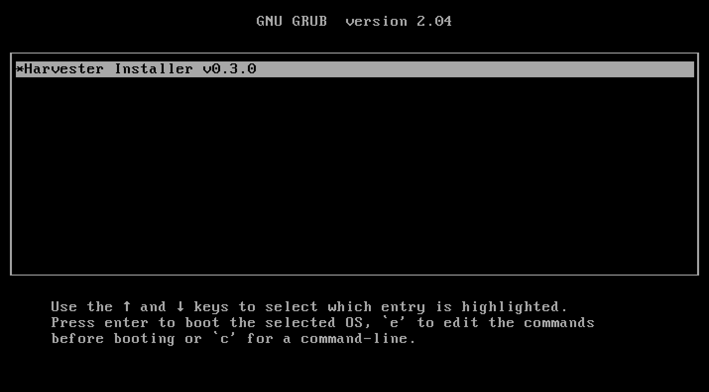
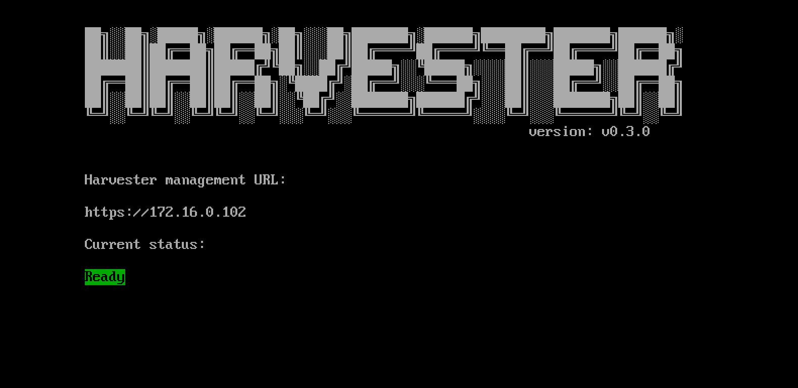

# ISO Installation

To get the Harvester ISO, download it from the [Github releases.](https://github.com/harvester/harvester/releases)

During the installation you can either choose to form a new cluster, or join the node to an existing cluster.

Note: This [video](https://youtu.be/97ADieBX6bE) shows a quick overview of the ISO installation.

<iframe width="950" height="475" src="https://www.youtube.com/embed/97ADieBX6bE" title="YouTube video player" frameborder="0" allow="accelerometer; autoplay; clipboard-write; encrypted-media; gyroscope; picture-in-picture" allowfullscreen></iframe>

1. Mount the Harvester ISO disk and boot the server by selecting the `Harvester Installer` option.
   
1. Choose the installation mode by either creating a new Harvester cluster, or by joining an existing one.
1. Choose the installation device that Harvester will be formatted to.
1. Configure the hostname and select the network interface for the management network. By default, Harvester will create a bonded NIC named `harvester-mgmt`, and the IP address can either be configured via DHCP or a static assigned a static one.
   
1. (Optional) Configure the DNS servers. Use commas as a delimiter.
1. Configure the `Virtual IP` which you can use to access the cluster or join the cluster to other nodes.
1. Configure the `cluster token`. This token will be used for adding other nodes to the cluster.
1. Configure the login password of the host. The default SSH user is `rancher`.
1. (Optional) Configure the NTP Servers of the node. This defaults to `0.suse.pool.ntp.org`.
1. (Optional) If you need to use an HTTP proxy to access the outside world, enter the proxy URL address here. Otherwise, leave this blank.
1. (Optional) You can choose to import SSH keys from a remote URL server. Your GitHub public keys can be used with `https://github.com/<username>.keys`.
1. (Optional) If you need to customize the host with a cloud-init config, enter the HTTP URL here.
1. After confirming the installation options, Harvester will be installed to your host. The installation may take a few minutes to be complete.
1. Once the installation is complete, it will restart the host. After the restart, the Harvester console containing the management URL and status will be displayed. You can Use `F12` to switch between the Harvester console and the Shell.
1. The default URL of the web interface is `https://your-virtual-ip`.
   
1. You will be prompted to set the password for the default `admin` user when logging in for the first time.
   
