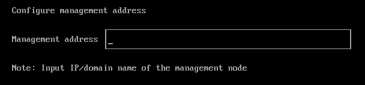

# Management Address
Harvester provides a fixed virtual IP (VIP) as the management address. Users can see the management address on the console dashboard after installation.

## Usages
The management address has two usages.

- Allow users to access the Harvester UI via `https` protocol.

- Used by the other nodes to join the cluster. 

  

## Configure VIP 
Users can specify the VIP during installation. It can either be configured via DHCP or assigned a static one.

:::

In PXE boot, Harvester does not support setting the VIP via DHCP. It will be addressed in the next release.
Issue: https://github.com/harvester/harvester/issues/1410

:::
