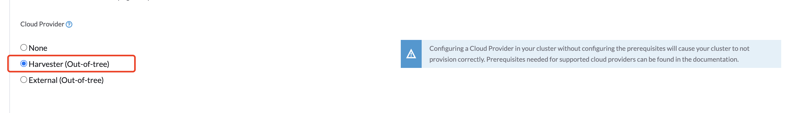
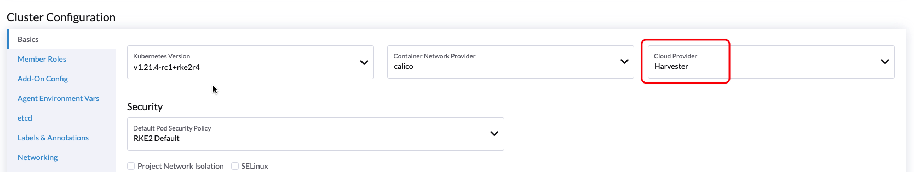
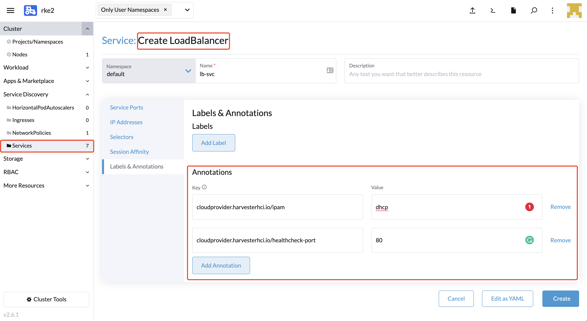

# Harvester Cloud Provider

_Available as of v0.3.0_

Users can now provision both [RKE1](./node/rke1-cluster.md) and [RKE2](./node/rke2-cluster.md) clusters in Rancher 2.6.1, using the built-in Harvester Node Driver. Harvester can now provide [load balancer](#load-balancer-support) support as well as [cluster Persistent Storage](./csi-driver.md) support to the guest Kubernetes cluster.

In this page we will learn:

- How to deploy the Harvester cloud provider in both RKE1 and RKE2.
- How to configure a [LoadBalancer service](#load-balancer-support).

## Deploying

### Prerequisites
- The Kubernetes cluster is built on top of Harvester virtual machines.
- The Harvester virtual machines run as guest Kubernetes nodes are in the same namespace.

### Deploying to the RKE1 Cluster with Harvester Node Driver
When spinning up an RKE cluster using the Harvester node driver, you can perform two steps to deploy the `Harvester` cloud provider:

- Select the `External` cloud provider.

  
  
- Generate add-on configuration and add it to the RKE YAML file.
  ```
  # depend on kubectl to operate the Harvester cluster
  curl -sfL https://raw.githubusercontent.com/harvester/cloud-provider-harvester/master/deploy/generate_addon.sh | sh -s <serviceAccount name> <namespace>
  ```
  
### Deploying to the RKE2 Cluster with Harvester Node Driver
When spinning up an RKE2 cluster using the Harvester node driver, select the `Harvester` cloud provider. The node driver will then help deploy both the CSI driver and CCM automatically.

  

## Load Balancer Support
After deploying the Harvester cloud provider, users can now configure a Kubernetes service of the type `LoadBalancer`. Currently, users can only set the load balancer configuration using `service annotations`.

  

:::note Example

You can specify the Harvester LoadBalancer service config through annotations. The `cloudprovider.harvesterhci.io/healthcheck-port` annotation is required. For example:

- `cloudprovider.harvesterhci.io/ipam: dhcp` - if the network of your Kubernetes nodes supports DHCP.
- `cloudprovider.harvesterhci.io/healthcheck-port: 80` - specify the port of your service.

:::

### IPAM
Harvester's built-in load balancer supports both `pool` and `dhcp` modes. Users can specify the IPAM mode using the annotation key `cloudprovider.harvesterhci.io/ipam`. This value defaults to `pool`.

- pool: You should configure an IP address pool in Harvester in advance. The Harvester LoadBalancer controller will allocate an IP address from the IP address pool for the load balancer.
    - Refer to the [guideline](https://github.com/kube-vip/kube-vip-cloud-provider#global-and-namespace-pools) to configure an IP address pool. E.g, for a `Namespace` pool,
      a service will take an address based upon its namespace pool cidr/range-namespace. These would look like the following:
        ```YAML
        $ kubectl get configmap -n kube-system kubevip -o yaml

        apiVersion: v1
        kind: ConfigMap
        metadata:
        name: kubevip
        namespace: kube-system
        data:
        cidr-default: 192.168.0.200/29
        cidr-development: 192.168.0.210/29
        cidr-finance: 192.168.0.220/29
        cidr-testing: 192.168.0.230/29
        ```                                                                                                                                                                                               
- dhcp:  A DHCP server is required. The Harvester LoadBalancer controller will request an IP address from the DHCP server of the Kubernetes nodes.

### Health Checks
The Harvester load balancer supports TCP health checks. Supported annotations are shown below:

| Key | Value | Required | Description |
|:---|:---|:---|:---|
| `cloudprovider.harvesterhci.io/healthcheck-port` | string | true | Specifies the port. The prober will access the address composed of the backend server IP and the port.
| `cloudprovider.harvesterhci.io/healthcheck-success-threshold` | string | false | Specifies the health check success threshold. The default value is 1. If the number of times the prober continuously detects an address successfully reaches the success threshold, then the backend server can start to forward traffic.
| `cloudprovider.harvesterhci.io/healthcheck-failure-threshold` | string | false | Specifies the success and failure threshold. The default value is 3. The backend server will stop forwarding traffic if the number of health check failures reaches the failure threshold.
| `cloudprovider.harvesterhci.io/healthcheck-periodseconds` | string | false |  Specifies the health check period. The default value is 5 seconds.
| `cloudprovider.harvesterhci.io/healthcheck-timeoutseconds` | string | false | Specifies the timeout of every health check. The default value is 3 seconds.
