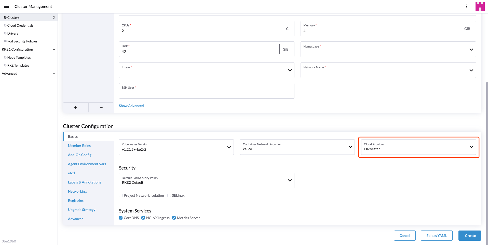

# Harvester CSI Driver

The Harvester Container Storage Interface (CSI) Driver provides a CSI interface used by guest Kubernetes clusters in Harvester. It connects to the host cluster and hot-plugs host volumes to the virtual machines (VMs) to provide native storage performance.

## Deploying

### Prerequisites

- The Kubernetes cluster is built on top of Harvester virtual machines.
- The Harvester virtual machines run as guest Kubernetes nodes are in the same namespace.

### Deploying with Harvester RKE2 Node Driver

When spinning up a Kubernetes cluster using Rancher RKE2 node driver, the Harvester CSI driver will be deployed when Harvester cloud provider is selected.



### Deploying with Harvester RKE1 Node Driver

- Select the external cloud provider option.

- [Generate addon configuration](https://github.com/harvester/harvester-csi-driver/blob/master/deploy/generate_addon.sh) and add it in the RKE config YAML.

```
# depend on kubectl to operate the Harvester cluster
./deploy/generate_addon.sh <serviceaccount name> <namespace>
```
