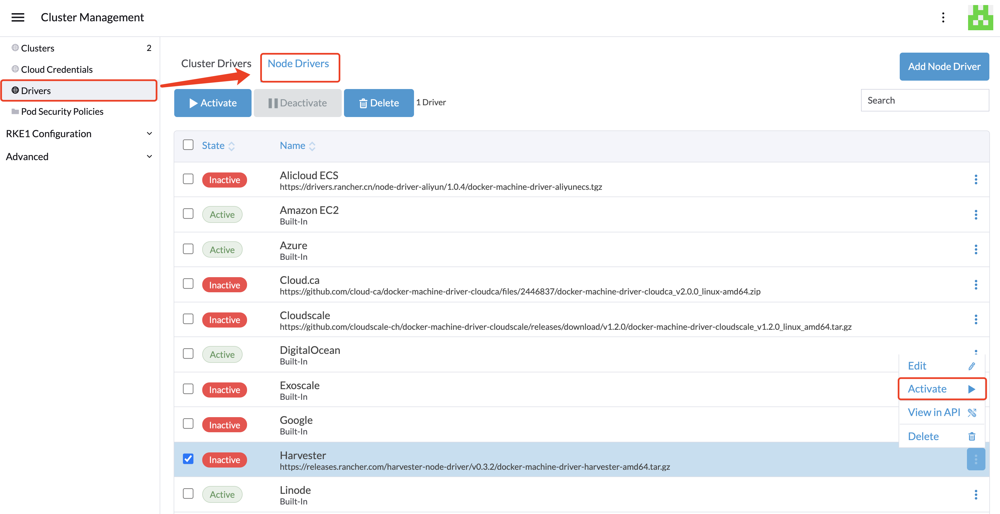

# Harvester Node Driver

The Harvester node driver is used to provision VMs in the Harvester cluster. In this section, you'll learn how to configure Rancher to use the Harvester node driver to launch and manage Kubernetes clusters.

A node driver is the same as a [Docker Machine driver](https://docs.docker.com/machine/), and the project repo is available at [harvester/docker-machine-driver-harvester](https://github.com/harvester/docker-machine-driver-harvester).

Users can now provision RKE1/RKE2 Kubernetes clusters in Rancher `v2.6.1` or above using the built-in Harvester node driver. 
Additionally, Harvester now can provide built-in [Load Balancer support](../cloud-provider.md) as well as raw cluster [persistent storage](../csi-driver.md) support to the guest Kubernetes cluster.

:::note

Currently only Rancher v2.6.1 or above is compatible with Harvester v0.3.0.

:::

## Enable Harvester Node Driver

The Harvester node driver is not enabled by default from the Rancher UI. Click the `Cluster Management` tab to enable the Harvester node driver.

1. Click the `Drivers` page, then click the `Node Drivers` tab 
2. Select the Harvester node driver, then click `Activate` to enable the Harvester node driver

Now users can spin up Kubernetes clusters on top of the Harvester cluster and manage them there.

## RKE1 Kubernetes Cluster
Click to learn [how to create RKE1 Kubernetes Clusters](./rke1-cluster.md).

## RKE2 Kubernetes Cluster
Click to learn [how to create RKE2 Kubernetes Clusters](./rke2-cluster.md).