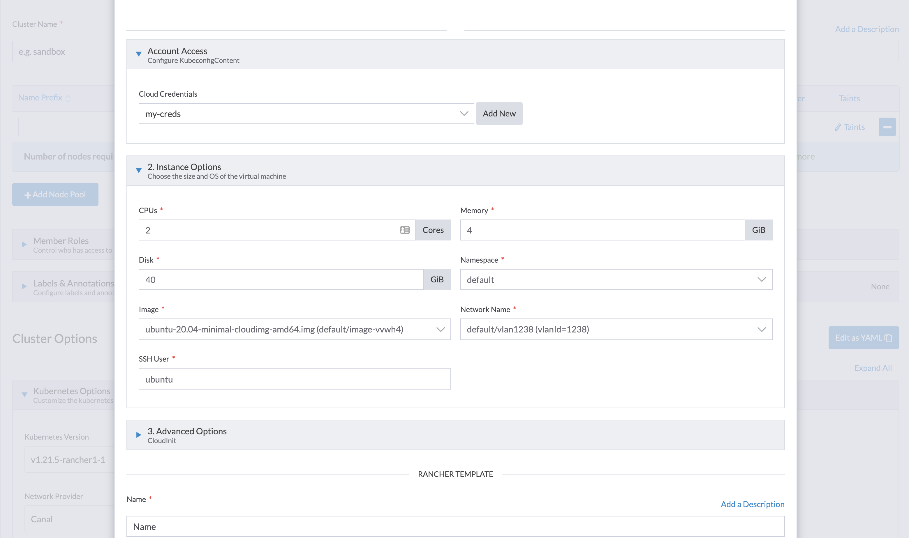
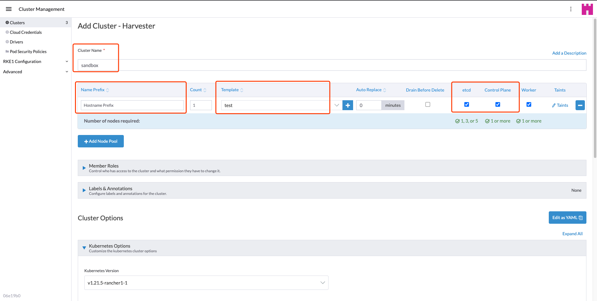

# Creating an RKE1 Kubernetes Cluster

Users can now provision RKE1 Kubernetes clusters on top of the Harvester cluster in Rancher `v2.6.1+` using the built-in Harvester node driver.

:::note

- Harvester RKE1 node driver is in tech preview.
- VLAN network is required for Harvester node driver.

:::

### Create Your Cloud Credentials

1. Click **☰ > Cluster Management**.
1. Click **Cloud Credentials**.
1. Click **Create**.
1. Click **Harvester**.
1. Enter your cloud credential name.
1. Select "Imported Harvester" or "External Harvester".
1. Click **Create**.

### Create Node Template 

You can use the Harvester node driver to create node templates and eventually node pools for your Kubernetes cluster.

1. Configure the  **Cloud Credentials**.
1. Configure **Instance Options**:
    * Configure the CPU, memory, and disk
    * Select an OS image that is compatible with the `cloud-init` config.
    * Select a network that the node driver is able to connect to; currently, only `VLAN` is supported.
    * Enter the SSH User; the username will be used to ssh to nodes. For example, a default user of the Ubuntu cloud image will be `ubuntu`.
1. Enter a **RANCHER TEMPLATE** name.

See [nodes hosted by an infrastructure provider](https://rancher.com/docs/rancher/v2.5/en/cluster-provisioning/rke-clusters/node-pools/) for more information.

### Create RKE1 Kubernetes Cluster

Users can create an RKE1 Kubernetes cluster from the **Cluster Management** page via the Harvester RKE1 node driver.

1. Select **Clusters** menu.
1. Click **Create** button.
1. Toggle Switch to **RKE1**.
1. Select Harvester node driver.
1. Enter **Cluster Name** (required).
1. Enter **Name Prefix** (required).
1. Enter **Template** (required).
1. Select **etcd** and **Control Plane** (required).
1. Click **Create**.

