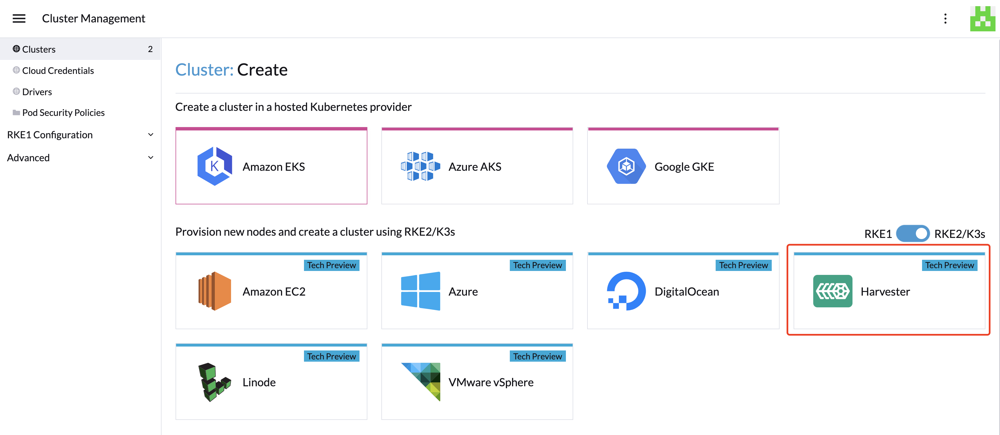
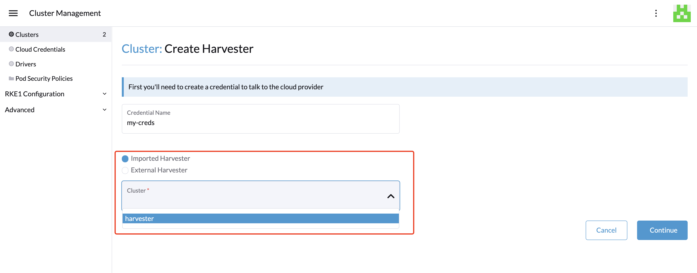
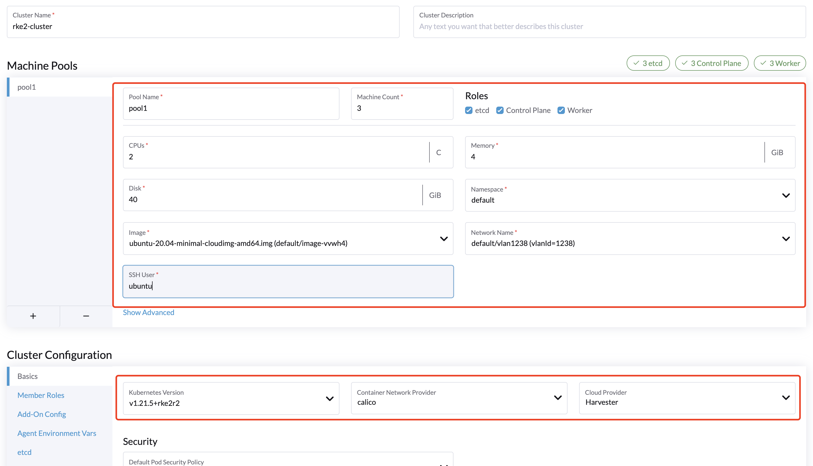

# Creating an RKE2 Kubernetes Cluster

Users can now provision RKE2 Kubernetes clusters on top of the Harvester cluster in Rancher `v2.6.1+` using the built-in Harvester node driver.

:::note

- Harvester RKE2 node driver is in tech preview.
- VLAN network is required for Harvester node driver.

:::

### Create Your Cloud Credentials

1. Click **☰ > Cluster Management**.
2. Click **Cloud Credentials**.
3. Click **Create**.
4. Click **Harvester**.
5. Enter your cloud credential name
6. Select "Imported Harvester" or "External Harvester".
7. Click **Create**.

###  Create RKE2 Kubernetes Cluster

Users can create a RKE2 Kubernetes cluster from the **Cluster Management** page via the RKE2 node driver.

1. Select **Clusters** menu.
2. Click **Create** button.
3. Toggle Switch to **RKE2/K3s**.
4. Select Harvester node driver.
5. Select a **Cloud Credential**.
6. Enter **Cluster Name** (required).
7. Enter **Namespace** (required).
8. Enter **Image** (required).
9. Enter **Network Name** (required).
10. Enter **SSH User** (required).
11. Click **Create**.

:::note

RKE2 v1.21.5+rke2r2 or above provides a built-in Harvester Cloud Provider and Guest CSI driver integration.

- Currently only imported Harvester clusters are supported automatically.

:::
