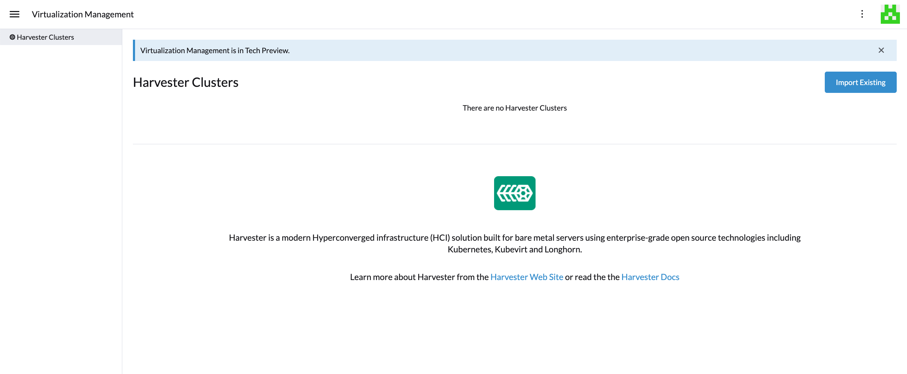

## Rancher Integration

_Available as of v0.3.0_

[Rancher](https://github.com/rancher/rancher) is an open-source multi-cluster management platform. Harvester has integrated Rancher by default starting with Rancher v2.6.1.

Users can now import and manage multiple Harvester clusters using the Rancher [Virtualization Management](virtualization-management.md) page and leverage the Rancher [authentication](https://rancher.com/docs/rancher/v2.6/en/admin-settings/authentication/) feature and RBAC control for [multi-tenancy](https://rancher.com/docs/rancher/v2.6/en/admin-settings/rbac/) support.



## Deploying Rancher

Previously in Harvester v0.2.0, users had the option to enable the embedded Rancher server. This option has been removed from Harvester `v0.3.0`. 

To use Rancher with Harvester, please install the Rancher server separately from the Harvester. As an option, You can spin up a VM in the Harvester and install the Rancher v2.6.1 or above to try out the integration features.

### Quick Start Guide
1. Begin creation of a custom cluster by provisioning a Linux host. Your host can be any of the following:
    - A cloud-hosted virtual machine (VM)
    - An on-premises VM
    - A bare-metal server
1. Log into your Linux host using your preferred shell, such as PuTTy or a remote terminal connection.
1. From your shell, enter the following command:

```shell
# for a quick evaluation, you can run the Rancher server with the following command
$ sudo docker run -d --restart=unless-stopped -p 80:80 -p 443:443 --privileged rancher/rancher:v2.6.2
```

:::note

For more information about how to deploy the Rancher server, please refer to the Rancher [documentation](https://rancher.com/docs/rancher/v2.6/en/quick-start-guide/deployment/).

:::

## Virtualization Management

With Rancher's Virtualization Management, users can now import and manage Harvester clusters. By clicking on one of the clusters, users are able to view and manage the downstream Harvester resources such as VMs, images, volumes, etc. Additionally, Rancher's VM feature has leveraged existing Rancher features such as authentication with various auth providers and multi-tenant support.

For more details, please reference the [virtualization management](virtualization-management.md) page.


:::note

Virtualization Management is in Tech Preview.

:::

## Creating Kubernetes Clusters using the Harvester Node Driver

[Harvester node driver](./node/node-driver.md) is used to provision VMs in the Harvester cluster, which Rancher uses to launch and manage Kubernetes clusters.

Starting with Rancher `v2.6.1`, the Harvester node driver has been added by default. Users can reference this [doc](./node/node-driver.md) for more details.

:::note

Harvester Node Driver is in Tech Preview.

:::
