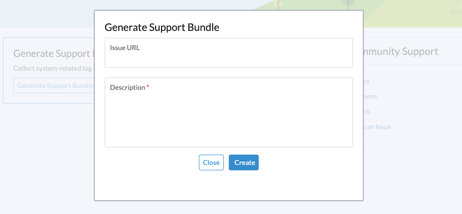

## Generate a Support Bundle

Users can generate a support bundle in the Harvester GUI with the following steps:

- Click the `Support` link at the bottom-left of Harvester Web UI.
    

- Click `Generate Support Bundle` button.
    

- Enter a useful description for the support bundle and click `Create` to generate and download a support bundle.
    

## Access Embedded Rancher

You can access the embedded Rancher dashboard via `https://{{HARVESTER_IP}}/dashboard/c/local/explorer`.

:::note

We only support to use the embedded Rancher dashboard for debugging and validation purpose.
For Rancher's multi-cluster and multi-tenant integration, please refer to the docs [here](../rancher/rancher-integration.md).

:::

## Access Embedded Longhorn

You can access the embedded Longhorn UI via `https://{{HARVESTER_IP}}/dashboard/c/local/longhorn`.

:::note

We only support to use the embedded Longhorn UI for debugging and validation purpose .

:::
