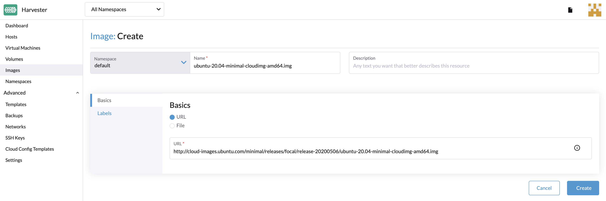

# Upload Images

Currently, there are three ways that are supported to create an image: uploading images via URL, uploading images via local files, and creating images via volumes.

### Upload Images via URL

To import virtual machine images in the **Images** page, enter a URL that can be accessed from the cluster. Description and labels are optional.
:::note

The image name will be auto-filled using the URL address's filename. You can customize the image name at any time.

:::

### Upload Images via Local File

Currently, qcow2, raw, and ISO images are supported.

:::note

- Please do not refresh the page until the file upload is finished.
- This feature is temporarily unusable on the single cluster UI and will be fixed via [#1415](https://github.com/harvester/harvester/issues/1415).

:::

### Create Images via Volumes

On the **Volumes** page, click **Export Image**. Enter image name to create image.

