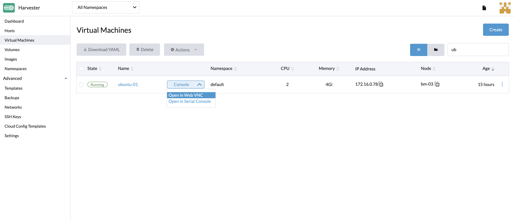

# Access to the Virtual Machine (VM)

Once the VM is up and running, you can access it using either the Virtual Network Computing (VNC) client or the serial console from the Harvester UI.

Additionally, you can connect directly from your computer's SSH client.

## Access with the Harvester UI

VMs can be accessed from the UI directly using either VNC or the serial console.

If the VGA display is not enabled on the VM, as with the Ubuntu minimal cloud image, the VM can be accessed with the serial console.



## Access with the SSH Client

Enter the IP address of the host in a terminal emulation client, such as PuTTY. You may also run the following command to access the VM directly from your computer's SSH client:

```
 ssh -i ~/.ssh/your-ssh-key user@<ip-address-or-hostname>
```
