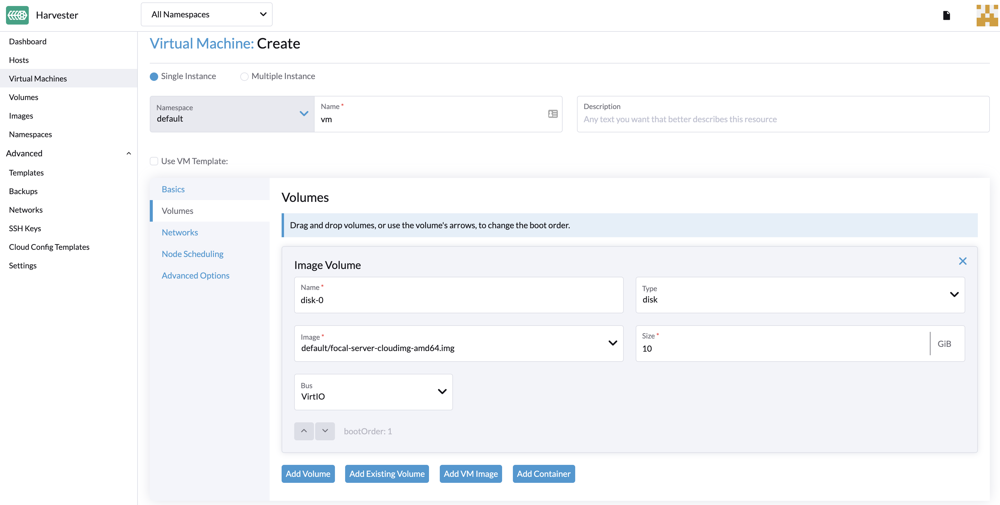

# Create a VM

## How to Create a VM

Create one or more virtual machines from the **Virtual Machines** page.

1. Choose the option to create either one or multiple VM instances.
1. The VM Name is a required field.
1. The VM Template is optional. You can select ISO, raw, and Windows image templates as default options.
1. Configure the CPU and Memory of the VM.
1. Select SSH keys or upload new keys.
1. Select a custom VM image on the **Volumes** tab. The default disk will be the root disk. You can add more disks to the VM.
1. To configure networks, go to the **Networks** tab. The **Management Network** is added by default. It is also possible to add secondary networks to the VMs using VLAN networks. You may configure these on **Advanced > Networks**.
1. Advanced options such as hostname and cloud-init data are optional. You may configure these in the **Advanced Options** section.




## Cloud Configuration Examples

Password configuration for the default user:

```YAML
#cloud-config
password: password
chpasswd: { expire: False }
ssh_pwauth: True
```

Network-data configuration using DHCP:

```YAML
version: 1
config:
  - type: physical
    name: eth0
    subnets:
      - type: dhcp
  - type: physical
    name: eth1
    subnets:
      - type: dhcp
```

You can also use the `Cloud Config Template` feature to include a pre-defined cloud-init configuration for the VM.

## Networks

### Management Network

A management network represents the default VM eth0 interface configured by the cluster network solution that is present in each VM.

By default, a VM can be accessed via the management network.

### Secondary Network

It is also possible to connect VMs using additional networks with Harvester's built-in [VLAN networks](../networking/harvester-network.md).
