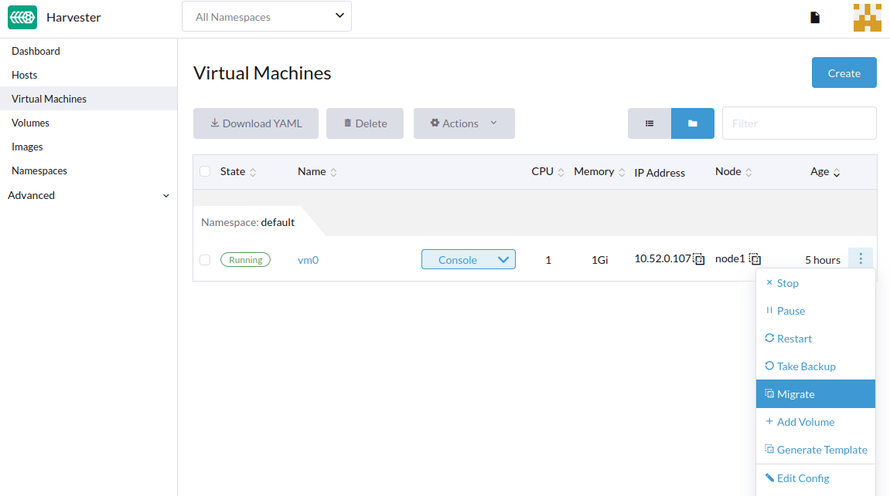
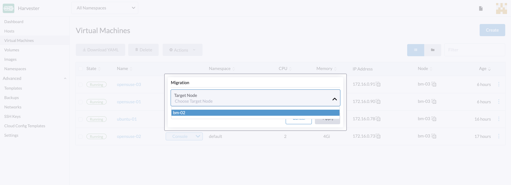

# Live Migration

Live migration means moving a virtual machine to a different host without downtime.

:::note

- Live migration is not allowed when the virtual machine is using a management network of bridge interface type.
- To support live migration, three or more hosts in the Harvester cluster are required due to [a known issue](https://github.com/harvester/harvester/issues/798).

:::

## Starting a Migration

1. Go to the **Virtual Machines** page.
1. Find the virtual machine that you want to migrate and select **⋮ > Migrate**.
1. Choose the node to which you want to migrate the virtual machine. Click **Apply**.

## Aborting a Migration

1. Go to the **Virtual Machines** page.
1. Find the virtual machine in migrating status that you want to abort. Select **⋮ > Abort Migration**.

## Migration Timeouts

### Completion Timeout

The live migration process will copy virtual machine memory pages and disk blocks to the destination. In some cases, the virtual machine can write to different memory pages or disk blocks at a higher rate than these can be copied. As a result, the migration process is prevented from being completed in a reasonable amount of time. 

Live migration will be aborted if it exceeds the completion timeout of 800s per GiB of data. For example, a virtual machine with 8 GiB of memory will time out after 6400 seconds.

### Progress Timeout

Live migration will also be aborted when copying memory doesn't make any progress in 150s.
